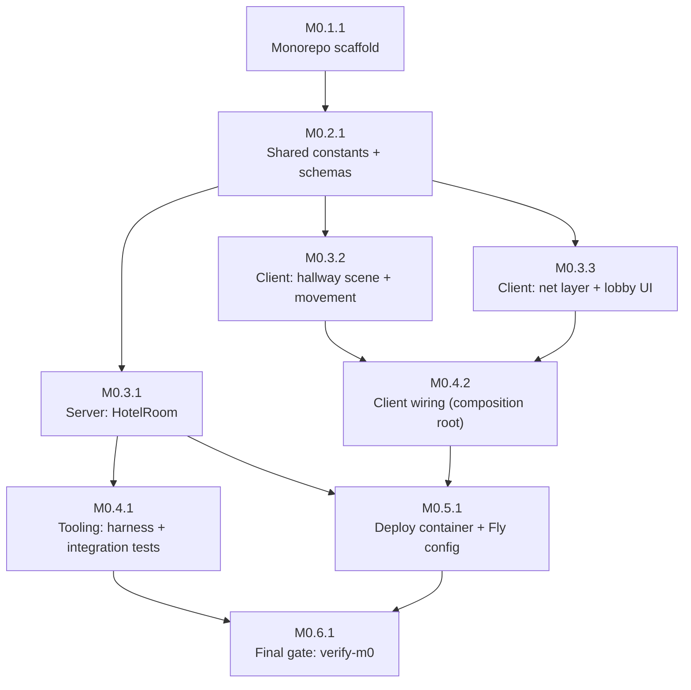

# M0 Plan — Walking Skeleton

Source spec: `.dev/specs/M0-spec.md` (R-1…R-9, V-1…V-9). Ground truth 2026-08-26: repo contains **no product code** — only `prd.md`, `roadmap.md`, `techstack.md`, `STATE.md`, `.opencode/` pipeline scaffolding. `apps/`, `packages/`, `tooling/`, `pnpm-workspace.yaml`, `package.json` do not exist. Node is v18.19.1; `pnpm`/`corepack` not on PATH on this machine. Every path below is created by the tasks unless noted otherwise. Package manager is **pnpm** per techstack §5.

## Planner decisions filling spec free-variables (flagged, not silently fixed)

Spec Assumptions 3, 5, 6 leave concrete numbers open and require them to exist as shared constants so V-5/V-6 are deterministic:

| Constant | Value | Rationale |
|---|---|---|
| `TILE_SIZE_PX` | 32 | tile vocabulary for later ranges (accusation ~2 tiles, rustle ~3 tiles) |
| `HALLWAY_MIN_X` / `HALLWAY_MAX_X` | 96 / 864 | 768 px strip = 24 tiles inside 960×240 viewport |
| `HALLWAY_Y` | 120 | vertical invariant for R-5 |
| `PLAYER_SPEED_PX_S` | 220 | ~7 tiles/s; crosses hall in ~3.5 s |
| `SERVER_MAX_SPEED_PX_S` | 330 | 1.5× normal — clamp threshold for V-6 |
| `CLIENT_INPUT_SEND_HZ` | 20 | client → server move-message rate |
| `SERVER_PATCH_RATE_MS` | 80 | ~12.5 Hz rebroadcast, inside required 10–15 Hz (R-6) |
| `INTERP_DELAY_MS` | 100 | remote-avatar render delay for interpolation |
| `ROOM_CODE_LENGTH` | 4 | per Assumption 3 |
| `ROOM_CODE_ALPHABET` | `ABCDEFGHJKMNPQRSTUVWXYZ23456789` | uppercase, no I/L/O/0/1 ambiguity |
| `AVATAR_COLORS` | 6 distinct hex colors | seat-indexed, lets two browsers distinguish dots (V-9b) |
| `RESULTS_PAYLOAD` | `null` | R-7 forbids winner/reveal fields |

Other planner choices (reversible, non-blocking):
- **Deploy host: Fly.io** — spec delegates choice to planner (Fly.io or Railway per techstack §5). `fly.toml` is committed; `railway.json` swap is trivial. Executing the deploy is an **operator step**, not a builder task (see below).
- **`tooling/` workspace included now** — techstack §5 lists it; spec omits it. Natural home for integration harness (V-3/V-6/V-9a) and smoke script (V-8), keeping `apps/server` free of e2e weight. Minimal in M0.
- **Sync transport** — one Colyseus Schema `RoomState` with `setPatchRate(80)`; inbound RPC validated with Zod (techstack supporting cast). Position traffic rides schema deltas at controlled cadence — measurable ≥8 Hz.
- **Host departure** (spec silent) — `hostSessionId` reassigns to earliest-joined remaining player so lobby cannot dead-end.

## Task graph



Stages & parallel groups:

```
S1  M0.1.1                                              (alone — scaffold)
S2  M0.2.1                                              (alone — shared foundation)
S3  PG-A: M0.3.1 ∥ M0.3.2 ∥ M0.3.3                     (file-disjoint: server vs client/game vs client/net+ui)
S4  PG-B: M0.4.1 ∥ M0.4.2                               (file-disjoint: tooling vs client composition root)
S5  M0.5.1                                              (alone — container + deploy config)
S6  M0.6.1                                              (alone — final verification gate)
```

Critical path: `M0.1.1 → M0.2.1 → M0.3.2 → M0.4.2 → M0.5.1 → M0.6.1` (6 tasks). The server path `M0.1.1 → M0.2.1 → M0.3.1 → M0.4.1 → M0.6.1` is one edge shorter but `M0.4.1` cannot start before `M0.3.1`; spawning PG-A concurrently minimizes builder idle time.

**Operator steps (NOT builder tasks — human/orchestrator owns them):**
1. Provision Fly.io account + app (already flagged pending in STATE.md). Run `fly launch --no-deploy` then `fly deploy` from repo root after M0.5.1 merges; rename `app` in `fly.toml` if name taken.
2. Record resulting public HTTPS URL in `STATE.md` Decisions and `deploy/README.md` (`PUBLIC_URL=<...>`) so anyone can rerun V-8.
3. Only then can verifier run V-8 (live) and V-9b (two browsers on different networks). All other V-criteria are automatable in-repo and gated by M0.6.1.

---

## Tasks

### M0.1.1 — Scaffold pnpm monorepo with four workspace skeletons
- Stage: S1
- Depends on: []
- Parallel group: no
- Spec refs: R-1, V-1
- Files owned: `package.json`, `pnpm-workspace.yaml`, `.npmrc`, `.gitignore`, `tsconfig.base.json`, `apps/client/**`, `apps/server/**`, `packages/shared/**`, `tooling/**` (skeletons only — no feature logic)
- Description: Create workspace root and all four workspaces per techstack §5. Root `package.json`: name `turnover`, `private:true`, `"packageManager":"pnpm@9.x"`, `engines.node>=18`, scripts `typecheck`/`build`/`test` = `pnpm -r <same>`, plus `dev:server`, `dev:client`, `smoke:local`, `smoke:remote`, `verify:m0` forwarders (targets may not exist yet). `pnpm-workspace.yaml` lists `apps/*`, `packages/*`, `tooling`. `.npmrc` with `shamefully-hoist=false`. Root `tsconfig.base.json` (`strict:true`, `moduleResolution:bundler`, `target:ES2022`). Per workspace minimal but real skeleton: `packages/shared` (`@grandhotel/shared`, type module, `src/index.ts` exporting placeholder, trivial Vitest file); `apps/server` (`@grandhotel/server`, deps `colyseus`, `express`, `zod`, `src/index.ts` booting Colyseus `Server` on port 2567 with `GET /healthz → {ok:true}`, trivial Vitest); `apps/client` (`@grandhotel/client`, deps `phaser@3`, `colyseus.js`, `index.html` with `#app` + `#overlay`, `src/main.ts` logging "boot", `vite.config.ts`, trivial Vitest with jsdom/node env); `tooling` (`@grandhotel/tooling`, deps `colyseus.js`, `tsx`, `vitest`, `src/smoke.ts` placeholder exiting 1 "not implemented", trivial Vitest). Each workspace gets `typecheck` (`tsc --noEmit`), `build`, `test` (`vitest run`). Install must succeed from clean clone. Do NOT implement features — this task is structure + green pipeline.
- Verify: `npm i -g pnpm@9 2>/dev/null || corepack enable; pnpm install && pnpm -r typecheck && pnpm -r build && pnpm -r test` — all exit 0; `ls apps/client apps/server packages/shared tooling` shows four workspaces. (This is V-1 minus fresh-clone nuance, re-checked in M0.6.1.)

### M0.2.1 — Build shared package: tuning constants, state schema, message schemas
- Stage: S2
- Depends on: [M0.1.1]
- Parallel group: no
- Spec refs: R-2, V-2 (also foundation for R-3…R-7 consumers)
- Files owned: `packages/shared/src/**`, `packages/shared/test/**`, `packages/shared/package.json` (deps), `packages/shared/tsconfig.json`
- Description: Replace `packages/shared` placeholder with single source of truth. Create `src/constants.ts`, `src/state.ts`, `src/messages.ts`, `src/roomCode.ts`, `src/index.ts` barrel, plus `test/constants.spec.ts`. `constants.ts`: every PRD §7 row as named const — `MAX_PLAYERS=6`, `SHIFT_LENGTH_S=300`, `PREP_TIME_MS=5000`, `UNPREP_TIME_MS=3000`, `COVERAGE_TARGET=0.8`, `FRESHNESS_WINDOW_MS=75_000`, `ELEVATOR_ARRIVE_MS=3000`, `ELEVATOR_RIDE_MS=2000`, `ELEVATOR_CAPACITY=2`, `ACCUSATION_RANGE_TILES=2`, `RUSTLE_RANGE_TILES=3` — plus free variables from decision table (`TILE_SIZE_PX`, `HALLWAY_MIN_X`, `HALLWAY_MAX_X`, `HALLWAY_Y`, `PLAYER_SPEED_PX_S`, `SERVER_MAX_SPEED_PX_S`, `CLIENT_INPUT_SEND_HZ`, `SERVER_PATCH_RATE_MS`, `INTERP_DELAY_MS`, `ROOM_CODE_LENGTH`, `AVATAR_COLORS`, `RESULTS_PLACEHOLDER=null`). JSDoc each with PRD §7 row or "M0 free variable, see plan". `state.ts`: Colyseus `@colyseus/schema` classes shared by server (authority) and client (decoder): `PlayerState { sessionId:string, name:string, colorIndex:number, x:number }`, `RoomState { players: MapSchema<PlayerState>, phase:"waiting"|"playing"|"results", hostSessionId:string, resultsPayload:any = null }` — no winner/traitor fields. `messages.ts`: Zod schemas for inbound RPCs `MoveMsg { dx:number, dy:number, seq:number }`, `AdvancePhaseMsg {}`, and outbound `PhaseChanged`, `JoinRejected{reason:"full"|"bad-name"}`. `roomCode.ts`: pure generator returning `ROOM_CODE_LENGTH` chars from unambiguous alphabet, takes `rng` for testability. `test/constants.spec.ts` satisfies V-2: assert each exported §7 constant equals PRD §7 table value exactly (spot-set from V-2: shift 5:00, prep 5s/un-prep 3s, coverage 80%, freshness 75s, elevator 3s/2s/cap 2, accusation ~2 tiles, rustle ~3 tiles, `MAX_PLAYERS=6`); plus roomCode test (length, alphabet membership). Update `package.json` deps (`@colyseus/schema`, `zod`) and build to ESM + d.ts. Consumers import via `@grandhotel/shared`.
- Verify: `pnpm --filter @grandhotel/shared test && pnpm --filter @grandhotel/shared build` exit 0; `grep -q "MAX_PLAYERS = 6" packages/shared/src/constants.ts` succeeds.

### M0.3.1 — Implement authoritative HotelRoom: roster, cap, lifecycle, movement relay
- Stage: S3
- Depends on: [M0.2.1]
- Parallel group: yes (PG-A)
- Spec refs: R-2, R-3, R-4, R-6, R-7, V-4, V-6 (server half), V-7
- Files owned: `apps/server/src/**` (esp. `rooms/HotelRoom.ts`, `index.ts`), `apps/server/test/**`
- Description: All server logic — do not touch other workspaces. `rooms/HotelRoom.ts` extends `Room<RoomState>`: `onCreate` sets `maxClients = MAX_PLAYERS` (import the shared constant — R-2 forbids local literal `6`), `setPatchRate(SERVER_PATCH_RATE_MS)`, seeds `phase="waiting"`. `onJoin(client, options)` validates `options.name` (trimmed non-empty, ≤24 chars) → reject via `throw new Error` with reason `bad-name` surfaced to client; assigns `colorIndex = seat count`, adds `PlayerState` with `x = (HALLWAY_MIN_X+HALLWAY_MAX_X)/2`; first joiner becomes `hostSessionId`; if full, Colyseus cap rejects 7th client before `onJoin` (test asserts). Lifecycle: handler for `AdvancePhaseMsg` — only from `hostSessionId`, stepwise `waiting→playing→results`, refuse further advances; `resultsPayload` stays `null` (R-7); broadcast via schema delta so all clients observe transitions (V-7); on host leave reassign `hostSessionId` to earliest remaining joiner. Movement: handler for `MoveMsg` validated with Zod; track per-player `lastMoveAt`+`lastX`; compute `dt` from server clock; clamp `newX = lastX + clamp(dx, ±SERVER_MAX_SPEED_PX_S*dt)` then hard-clamp to `[HALLWAY_MIN_X, HALLWAY_MAX_X]`; ignore `dy` entirely (y invariant — R-5/R-6); write into `state.players[sessionId].x`. Positions ride schema deltas at `SERVER_PATCH_RATE_MS` ⇒ ≤12.5 Hz updates (R-6, V-6). `index.ts` (extend from M0.1.1): mount room type `hotel` on Colyseus server; keep `/healthz`; add `GET /` placeholder (static arrives in M0.5.1). Tests in `apps/server/test/`: (a) cap test — six joins succeed, 7th rejected with observable error, roster size stays 6 (V-4); (b) phase test — initial `waiting`, host advance → `playing`, second → `results` with `resultsPayload===null` and no winner/traitor keys, non-host advance refused, two simulated clients both observe full sequence (V-7); (c) clamp unit — pure helper: legal moves pass, >max-speed·dt snaps down, out-of-bounds snaps to bound. Use `@colyseus/testing` or direct `Room` harness for (a)/(b).
- Verify: `pnpm --filter @grandhotel/server test && pnpm --filter @grandhotel/server typecheck` exit 0; `grep -n "MAX_PLAYERS" apps/server/src/rooms/HotelRoom.ts | grep -q "from.*@grandhotel/shared"` (no literal `6` in cap context) and `grep -rn "maxClients.*6" apps/server/src/` returns nothing.

### M0.3.2 — Build hallway scene: movement, clamping, pass-through bodies
- Stage: S3
- Depends on: [M0.2.1]
- Parallel group: yes (PG-A)
- Spec refs: R-5, V-5, R-6 (interpolation helper half)
- Files owned: `apps/client/src/game/**`, `apps/client/src/movement/**`, `apps/client/test/**` (movement/scene tests only)
- Description: Client gameplay modules — do NOT touch `src/net/`, `src/ui/`, `index.html`, or `src/main.ts` (owned by sibling tasks). Phaser Arcade Physics must stay disabled (techstack §6). `movement/horizontal.ts`: pure logic `step(x, dir, dt)` integrating `PLAYER_SPEED_PX_S`, `clampToBounds(x)` to `[HALLWAY_MIN_X,HALLWAY_MAX_X]`, y untouched by construction (no y param in API). `movement/interpolate.ts`: pure remote-position interpolator — ring buffer of `(t,x)` snapshots; `sample(now - INTERP_DELAY_MS)` lerps between surrounding snapshots, never extrapolates beyond `INTERP_DELAY_MS + one patch period`, falls back to last-known x when starved. `game/HallScene.ts` (Phaser.Scene key `"Hall"`): draws hallway strip (gray rect + subtle floor line, gray-box quality), spawns square avatars colored from `AVATAR_COLORS[colorIndex]`, keyboard cursor-keys **and** WASD (Assumption 5), calls `movement/horizontal.step` each frame with clamped dt (cap dt at 100 ms so tab-switch cannot tunnel clamp), sets sprite x directly — no physics body ever. Exposes `addRemote(id,colorIndex)`, `setRemoteX(id,x)`, `removeRemote(id)`, `getLocalX()`, `consumeInputDir(): -1|0|1` so net task can sample input without owning scene. Tests in `apps/client/test/`: (a) held-right converges exactly to `HALLWAY_MAX_X` and stays; held-left to `HALLWAY_MIN_X`; (b) y invariant is structural — `step` signature/output carries no y and `clampToBounds` idempotent at bounds; (c) two movers stepping while co-located produce identical independent trajectories (overlap displaces nobody); (d) interpolate: two snapshots 80 ms apart sampled midway lies between; far-ahead sampling returns newest x (no overshoot).
- Verify: `pnpm --filter @grandhotel/client test && pnpm --filter @grandhotel/client typecheck` exit 0; these are the V-5 automated assertions (visual overlap supplement deferred to verifier).

### M0.3.3 — Build client net layer (GameClient) + lobby UI overlay
- Stage: S3
- Depends on: [M0.2.1]
- Parallel group: yes (PG-A)
- Spec refs: R-3, R-4 (client observability), R-7 (host control UI), V-3 (flow prerequisite)
- Files owned: `apps/client/src/net/**`, `apps/client/src/ui/**`, `apps/client/index.html`, `apps/client/src/style.css`
- Description: Transport + DOM overlay — do NOT touch `src/game/`, `src/movement/`, or `src/main.ts`. `net/GameClient.ts`: escape-hatch interface per techstack §7 — `{ connect(name):Promise<void>; createRoom():Promise<string>; joinByCode(code):Promise<void>; sendMove(msg):void; advancePhase():void; onState(cb:(s:RoomStateView)=>void):Unsubscribe; onEvent(cb:(e:ClientEvent)=>void):Unsubscribe; disconnect():void }` where `RoomStateView` is plain-data projection (`players:{id,name,colorIndex,x}[]`, `phase`, `mySessionId`, `hostSessionId`) so gameplay/UI never imports Colyseus types directly. `net/ColyseusGameClient.ts`: implements over `colyseus.js` — `joinOrCreate`/`joinByCode` against room `hotel`, relays schema state into `RoomStateView` emissions, maps join failures (room-not-found, full, bad-name) into typed `ClientEvent`s (`rejected:{reason}`, `error:{message}`) so R-4 rejection is observable in UI. Reads endpoint from `import.meta.env.VITE_GAME_URL` defaulting to same origin (required for deploy). `ui/screens.ts`+`ui/dom.ts`: three vanilla-DOM screens toggled inside `#overlay`: (1) name entry (trimmed non-empty enforced client-side), (2) menu — Create room / Join with 4-char code input (uppercase, auto-filtered to shared alphabet), (3) room — roster list (names+color swatches), phase label, error/toast area, Host-only "Start round"/"Show results" button rendered iff `mySessionId===hostSessionId` calling `advancePhase()`. Wire via small pure reducer `ui/reducer.ts` (`Idle → Named(name) → InRoom`) with Vitest test — no browser needed; DOM functions kept thin. `style.css`: minimal gray-box styling; `index.html` gains overlay containers keeping `#app` for Phaser canvas mount.
- Verify: `pnpm --filter @grandhotel/client typecheck && pnpm --filter @grandhotel/client test` exit 0; reducer test asserts empty name blocked, valid code path transitions to InRoom, rejected event surfaces reason into state.

### M0.4.1 — Tooling: two-client integration harness, sync and exit-criterion tests, smoke script
- Stage: S4
- Depends on: [M0.3.1]
- Parallel group: yes (PG-B)
- Spec refs: R-3, R-6, R-9, V-3, V-6, V-8 (smoke mechanics), V-9(a)
- Files owned: `tooling/src/**` (esp. `harness/**`, `integration/**`, `smoke.ts`), `tooling/package.json` scripts
- Description: Everything under `tooling/src/` — file-disjoint from M0.4.2. `harness/spawn.ts`: boot real server (`@grandhotel/server` listener) on ephemeral port; returns `{url,close()}`. `harness/clients.ts`: helpers wrapping `colyseus.js` — `makeClient(name)`, `createRoom(c)`, `joinByCode(c,code)`, `collectState(c)` (subscribes state with receive timestamps). `integration/lobby.spec.ts` (V-3): A creates → non-empty code matching `ROOM_CODE_LENGTH`/alphabet; B joins by code with display name; both clients' projected rosters contain both names. `integration/sync.spec.ts` (V-6): A streams `sendMove` at `CLIENT_INPUT_SEND_HZ` toward one wall for 3 s; B records A's x-change events — average ≥8 Hz over window; then A sends one `MoveMsg` claiming displacement `>SERVER_MAX_SPEED_PX_S*dt` — B's observed x for A never jumps more than `SERVER_MAX_SPEED_PX_S*dt+ε` (clamped rebroadcast). `integration/exitcriterion.spec.ts` (V-9a): same harness; A streams movement; B samples A's x; assert monotonic progress toward target wall and final-sample staleness ≤250 ms (local build ⇒ tight bound). `smoke.ts` (replace M0.1.1 placeholder): parameterized by base URL (default `http://localhost:2567`, overridable `--url`/`SMOKE_URL`) — `GET /` expecting 200 + client HTML marker (`id="overlay"`), then two WSS connections completing create/join handshake with ≥1 exchanged position update; exit 0 on success, non-zero with printed reason otherwise. This one script powers both `smoke:local` and `smoke:remote` (V-8 mechanics). Add `test:integration` script to `tooling/package.json`; root `smoke:local`/`smoke:remote` forwarders (seeded in M0.1.1) now resolve.
- Verify: `pnpm --filter @grandhotel/tooling test:integration` exits 0 with three suites green; `pnpm smoke:local` (after starting server on ephemeral port or letting harness boot it) exits 0 — harness boot is preferred so no manual server needed.

### M0.4.2 — Wire client composition root: input → send, state → render, UI ↔ scene
- Stage: S4
- Depends on: [M0.3.2, M0.3.3]
- Parallel group: yes (PG-B)
- Spec refs: R-3, R-5, R-6, R-7 (render halves), V-6 (interpolation consumption)
- Files owned: `apps/client/src/main.ts`, `apps/client/src/bootstrap.ts` (if needed), `apps/client/src/app.ts` (optional composition helper)
- Description: Compose previously independent modules in `src/main.ts` (+ `bootstrap.ts` if separation helps). Only these files — siblings' modules are frozen APIs now; if an API gap forces change elsewhere, stop and report instead of editing. Flow: boot → show name screen (reducer Idle) → create/join via `GameClient` → on entering room: hide overlay menus, start Phaser game with `HallScene` (mount canvas into `#app`), add local avatar (own `colorIndex`), mirror roster changes into `HallScene.addRemote/setRemoteX/removeRemote` — remote x fed through `movement/interpolate.sample` driven by `requestAnimationFrame` so remote dots glide between patches (R-6). Input pump: `setInterval` at `CLIENT_INPUT_SEND_HZ` reading `HallScene.consumeInputDir()`; nonzero → `sendMove({dx,dy:0,seq})` where `dx = dir * PLAYER_SPEED_PX_S / CLIENT_INPUT_SEND_HZ`. Local avatar moves every frame via same pure `step` (instant self-feedback). Reducer InRoom drives: roster re-render on state change, phase label update, host buttons enabled iff host, rejected/error events shown in toast (R-4 visibility). Phase `results` shows label only — no winner data exists (R-7). Keep `import.meta.env.VITE_GAME_URL` wiring intact so same-origin deploy works.
- Verify: `pnpm --filter @grandhotel/client build && pnpm --filter @grandhotel/client typecheck` exit 0; scripted dev-loop check `pnpm dev:server &` + `pnpm dev:client &`; `curl -fsS http://localhost:<vite-port>/ | grep -q 'id="overlay"'`; kill both. (Full interactive behavior exercised by M0.6.1 smoke and verifier manual supplements.)

### M0.5.1 — Containerize: single-origin Dockerfile + Fly.io config + deploy notes
- Stage: S5
- Depends on: [M0.3.1, M0.4.2]
- Parallel group: no
- Spec refs: R-8, V-8 (config half; live execution is operator step)
- Files owned: `Dockerfile`, `.dockerignore`, `fly.toml`, `apps/server/src/static.ts`, `deploy/README.md`
- Description: Same-origin serving per techstack §5 deploy line. `apps/server/src/static.ts`: mount `express.static(<client-dist>)` + SPA fallback for `GET /` on same HTTP server owning WebSocket (guarded by env `STATIC_DIR` so dev mode unchanged). `Dockerfile` (repo root) multi-stage: stage 1 `node:20-slim` pnpm fetch/install; stage 2 build `@grandhotel/shared`, `@grandhotel/server`, `@grandhotel/client`; stage 3 runtime `node:20-slim` copying server dist, pruned `node_modules`, and client dist into `/srv/public`; `ENV STATIC_DIR=/srv/public PORT=8080`; `EXPOSE 8080`; `CMD ["node","apps/server/dist/index.js"]`. `.dockerignore` (node_modules, dist, .git, .dev, tooling coverage). `fly.toml`: `app="turnover-grandhotel"` (operator may rename if taken), `primary_region` suggestion, `[http_service] internal_port=8080, force_https=true`, `[[http_service.checks]] path="/healthz"`, `min_machines_running=1` comment (rooms are machine-affine; M0 runs one machine). `deploy/README.md`: operator runbook — `fly launch --no-deploy`, `fly deploy`, DNS note, and prominent placeholder `PUBLIC_URL=<fill-after-first-deploy>`; instructs recording final URL in `STATE.md` Decisions too.
- Verify: `docker build -t turnover-m0 . && docker run -d --rm -p 18080:8080 --name m0check turnover-m0 && sleep 3 && curl -fsS http://localhost:18080/healthz | grep -q '"ok":true' && curl -fsS http://localhost:18080/ | grep -q 'id="overlay"'; docker stop m0check` — all exit 0. If Docker daemon unavailable, run local equivalent: `STATIC_DIR=apps/client/dist PORT=18090 node apps/server/dist/index.js &` then same `curl` probes on 18090; flag docker-skip in handoff note.

### M0.6.1 — Final gate: aggregate verifier script proving milestone readiness
- Stage: S6
- Depends on: [M0.4.1, M0.5.1]
- Parallel group: no
- Spec refs: R-1…R-9 (aggregate), V-1…V-9 (all automated portions)
- Files owned: `scripts/verify-m0.sh` (executable), plus any fixes needed in owning workspaces to make the gate green (do not weaken assertions)
- Description: Create `scripts/verify-m0.sh` (`set -euo pipefail`, executable) chaining, in order: (1) `pnpm install --frozen-lockfile` (fresh-clone stand-in), (2) `pnpm -r typecheck && pnpm -r build && pnpm -r test` (V-1), (3) shared constants filter (V-2), (4) server suite (V-4, V-7), (5) client suite (V-5), (6) tooling integration suite — `test:integration` (V-3, V-6, V-9a), (7) Docker image build+run+`/healthz`+`GET /` probe (V-8 mechanics, skip with loud warning if no Docker), (8) `smoke:local` pointed at freshly booted built server (boots `node apps/server/dist/index.js` on scratch port with `STATIC_DIR` set, waits for `/healthz`, runs smoke handshake+position exchange, tears down). Print numbered PASS/FAIL summary mirroring V-1…V-9 (manual supplements marked SKIP-MANUAL). Run it end-to-end; fix any red item in the responsible workspace (in-scope for this task — it owns the green board), re-running until script exits 0. Do not weaken assertions.
- Verify: `bash scripts/verify-m0.sh` exits 0 with V-1…V-7 and V-9a PASS, V-8 PASS (or PASS-LOCAL-FALLBACK if no Docker), and explicit SKIP-MANUAL markers for the four documented supplements (V-3 screen glance, V-5 overlap visual, V-6 smoothness, V-9b two-browser observation). At that point milestone is verification-ready pending only operator deployment (V-8 live URL, V-9b).

---

## Coverage matrix

| Req | Satisfied by | Notes |
|---|---|---|
| R-1 / V-1 | M0.1.1, re-checked in M0.6.1 | workspace existence + install/typecheck/build/test |
| R-2 / V-2 | M0.2.1 (constants+tests), M0.3.1 (server enforces via constant) | server import verified in M0.3.1 |
| R-3 / V-3 | M0.3.1 (server roster), M0.3.3 (UI flow), M0.4.1 (transport test); manual supplement → verifier | name entry screen + code sharing |
| R-4 / V-4 | M0.3.1 (cap test), M0.3.3 (rejection surfaced to UI) | 6 joins succeed, 7th rejected observable |
| R-5 / V-5 | M0.3.2; manual supplement → verifier | clamp + pass-through + y invariant |
| R-6 / V-6 | M0.3.1 (clamp+patch rate), M0.3.2 (interpolator), M0.4.1 (≥8 Hz + clamp-over-transport), M0.4.2 (consumption) | 10–15 Hz, max-speed clamp, interpolation |
| R-7 / V-7 | M0.3.1 (phases+tests), M0.3.3 (host controls), M0.4.2 (label render) | waiting→playing→results, null payload |
| R-8 / V-8 | M0.5.1 (container+config+URL plumbing), M0.4.1/M0.6.1 (smoke script+local run); live URL = operator | same-origin HTTPS+WSS |
| R-9 / V-9 | M0.4.1 (V-9a automated ≤250 ms), M0.6.1 (gate); V-9b two-browser = operator+verifier | exit criterion |

Every R-1…R-9 and V-1…V-9 appears in ≥1 task. No circular dependencies (DAG verified above).

## Spec gaps / flags for orchestrator (none blocking)

1. **Movement numbers undefined** (Assumption 6) — fixed as shared constants above; tuning-dial candidates later.
2. **Room code format undefined** (Assumption 3) — finalized 4-char unambiguous alphabet.
3. **Host departure behavior unspecified** — reassigned to earliest remaining player; trivially changeable in M0.3.1.
4. **`tooling/` workspace** in techstack §5 but absent from spec scope text — included minimally; V-1 "every workspace" stays satisfiable.
5. **Deploy account** remains outstanding operator dependency (already in STATE.md): V-8-live and V-9b cannot run until human provisions Fly.io and records public URL.
6. **Environment note** — pnpm/corepack not on PATH on this machine; M0.1.1 pins `packageManager` so `npm i -g pnpm` or `corepack enable` suffices; builders should handle first.
