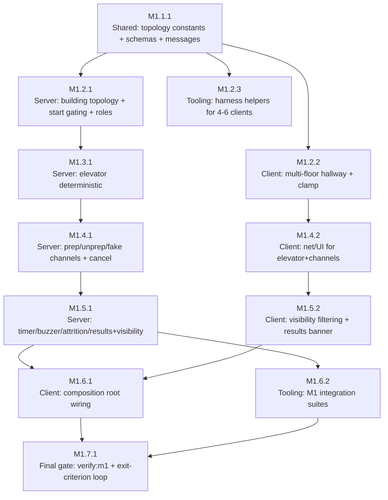

# M1 Plan — Full round loop

Source spec: `.dev/specs/M1-spec.md` (R-1…R-15, V-1…V-15). Ground truth 2026-08-26: repo has M0 walking skeleton merged — `packages/shared` exports M0 constants/state/messages, `apps/server` has `HotelRoom` with roster/cap/lifecycle/movement clamp (`computeClampedX`), `apps/client` has `HallScene` + `movement/horizontal` + `movement/interpolate` + `net/GameClient`+`ColyseusGameClient` + `ui/reducer/screens` + `main.ts` composition root, `tooling` has `harness/spawn+clients` + 3 integration suites + `smoke.ts`. Pnpm workspaces, `tsconfig.base.json` strict `verbatimModuleSyntax`. All paths below already exist unless noted; tasks modify them.

## Planner decisions filling spec free-variables (flagged, not silently fixed)

These are within spec tolerances; chosen to make V-1…V-15 deterministic and auditable.

| Free variable | Chosen value | Rationale |
|---|---|---|
| `ROOM_COUNT` | **24** | 3 floors × 8 rooms (spec allows 22–24; 8 per floor keeps denominator stable for V-11 coverage 80% = 19.2 → 20 rooms). Alternate 22/23 still passes V-1 tolerance but plan fixes 24 so tests have single truth. |
| `ROOMS_PER_FLOOR` | `[8,8,8]` | Sums to 24; partitioning logic in `packages/shared`. |
| `FLOOR_COUNT` | 3 guest floors + lobby (logical floors 0=lobby,1-3 guest) | Spec "grand lobby plus 3 guest floors". Lobby is floor 0 with distinct spawn, guest floors 1-3 hold rooms. |
| `FLOOR_Y_STEP` | **90** px | With `HALLWAY_Y=120`, floors sit at y = 120, 210, 300, 390. Fits 960×540 canvas with hallway strip height 40 px + elevator shafts. Reversible via constant. |
| `LOBBY_CENTER` | `{x:480, y:120}` i.e. `(HALLWAY_MIN_X+HALLWAY_MAX_X)/2`, `HALLWAY_Y+0*FLOOR_Y_STEP` | Gather-up spawn per R-4. Lobby shares hallway x-bounds, distinct floor index 0, no rooms. |
| `ROOM_WIDTH` / `ROOM_GAP` | 88 px / 8 px | 8 rooms ×88 + 7 gaps×8 = 760 px inside 768 px hallway (96→864). Room x-ranges: `room i → [96+i*96, 96+i*96+88)` per floor. Non-overlapping, partitions hall. |
| `ELEVATOR_A_X` / `ELEVATOR_B_X` | `HALLWAY_MIN_X+22` (=118) / `HALLWAY_MAX_X-22` (=842) | Two shafts at opposite ends per R-3; interactive zone ±18 px around x for call/ride. Cars per shaft independent. |
| `ELEVATOR_SHAFTS` | `["A","B"]` | Enum for shaft id; per-shaft queue FIFO. |
| Channel input | hold **E** (continuous) | Spec assumption 5 "hold is single key (e.g. hold E)"; client sends `channelStart` on keydown, `channelCancel` on keyup or leave/ride. Server is authority on timers. |
| Role secrecy transport | private `onMessage("role")` + per-client `PlayerState.myRole` filtered view | Spec assumption 9 "private onMessage or per-client PlayerState private field". Choose both: server sends `role` message to owner's session + projection filters `otherRole` to null. Tests assert `myRole` visible only to owner. |
| Timer acceleration | constructor/config `shiftLengthSOverride` + `vi.useFakeTimers()` | Spec assumption 6; production uses `SHIFT_LENGTH_S=300`, tests inject 10 s or fast-forward. Guarded by `NODE_ENV==="test"` or explicit option. |
| Lobby spawn on start | all players `x=LOBBY_CENTER.x`, `floor=0` then immediately teleport to lobby; subsequent elevator rides change floor | Satisfies "all players spawn at lobby gather-up position" even if they were in hallway during waiting. |

Other planner choices (reversible):
- Elevator queue semantics: when capacity 2 seats filled, third concurrent rider is **queued FIFO per shaft** until next car cycle, not rejected with error — but test V-3 accepts either queued or rejected as long as third rider does not board with first two. Task M1.3.1 documents FIFO queue.
- `ROOM_STATE` vocabulary stays `clean|prepped|trashed` only in M1 (no fresh/settled).
- Results payload fields: `winner: "staff"|"saboteur"`, `traitorReveal:{sessionId, name}` + `coverage` for debugging; no FR-22 recap fields.

## Task graph



Stages & parallel groups:

```
S1  M1.1.1                                                          (alone — shared foundation)
S2  PG-A: M1.2.1 ∥ M1.2.2 ∥ M1.2.3                               (file-disjoint: server vs client/game vs tooling harness)
S3  M1.3.1                                                          (alone — elevator, sequential on HotelRoom)
S4  PG-B: M1.4.1 ∥ M1.4.2                                          (file-disjoint: server vs client net/ui)
S5  PG-C: M1.5.1 ∥ M1.5.2                                          (file-disjoint: server vs client)
S6  PG-D: M1.6.1 ∥ M1.6.2                                          (file-disjoint: client main vs tooling suites)
S7  M1.7.1                                                          (alone — final verifier)
```

Critical path: `M1.1.1 → M1.2.1 → M1.3.1 → M1.4.1 → M1.5.1 → M1.6.1 → M1.7.1` (7 tasks). Parallel groups shorten wall-clock by ~3 tasks vs serial.

---

## Tasks

### M1.1.1 — Shared foundations: building topology constants, extended schemas, channel/elevator messages
- Stage: S1
- Depends on: []
- Parallel group: no
- Spec refs: R-1, R-2, R-3, R-4, R-5, R-11, R-14, R-15, V-1, V-15
- Files owned: `packages/shared/src/constants.ts`, `packages/shared/src/state.ts`, `packages/shared/src/messages.ts`, `packages/shared/src/topology.ts` (new), `packages/shared/src/index.ts`, `packages/shared/test/**`
- Description: Extend `@grandhotel/shared` as single source of truth. **constants.ts**: keep M0 constants, add `FLOOR_COUNT=3`, `ROOMS_PER_FLOOR=[8,8,8]`, `ROOM_COUNT=24`, `FLOOR_Y_STEP=90`, `LOBBY_CENTER={x:480,y:120}`, `ROOM_WIDTH=88`, `ROOM_GAP=8`, `ELEVATOR_A_X=118`, `ELEVATOR_B_X=842`, `ELEVATOR_INTERACT_RADIUS=18` (free variables, JSDoc "M1 free variable, see plan"). Re-export existing tuning constants so V-15 import sweep stays valid; do not introduce literals in consumer code. **topology.ts** (new pure helpers): `getHallBounds(floor):{minX,maxX,y}`, `getRoomRect(roomId):{floor,xMin,xMax,y}`, `getRoomAt(x,floor):roomId|null`, `isInsideRoom(x,floor,roomId):boolean`, `lobbyBounds`, deterministic room intervals `[96+i*96,96+i*96+88)` per floor. **state.ts**: extend Colyseus schemas without breaking M0 decoder compatibility: `PlayerState { sessionId, name, colorIndex, x, floor:number, role?:string (private), activeChannel?:"prep"|"unprep"|"fake"|null, channelTimer?:number }` — role never replicated in broadcast map (server filters); add `RoomData { id:string, floor:number, xMin:number, xMax:number, state:"clean"|"prepped"|"trashed" }` and `ElevatorCar { shaft:"A"|"B", floor:number, state:"idle"|"arriving"|"boarding", queue:string[] }`; extend `RoomState { players, phase, hostSessionId, resultsPayload, rooms:MapSchema<RoomData>, elevators:MapSchema<ElevatorCar>, shiftEndsAt:number, winner:"staff"|"saboteur"|null, traitorReveal:{sessionId,name}|null, coverage:number }` — new fields default to clean/idle/null so M0 clients decode. **messages.ts**: Zod schemas for new RPCs: `StartRoundMsg {}`, `CallElevatorMsg {shaft:"A"|"B"}`, `RideElevatorMsg {shaft:"A"|"B", destFloor:number}`, `ChannelStartMsg {type:"prep"|"unprep"|"fake", roomId:string}`, `ChannelCancelMsg {}`, `MoveMsg` stays but add optional `floor?` ignored (y invariant). Also outbound `RoleMsg {role:"staff"|"saboteur"}` and `ResultsMsg` (server-internal). Export barrel. Tests `packages/shared/test/topology.spec.ts` + `constants.spec.ts` extension: assert `ROOM_COUNT===24`, `ROOMS_PER_FLOOR` sum, each floor 7-8 rooms, `FLOOR_Y_STEP===90`, hallway bounds per floor equal `[96,864]`, room intervals non-overlapping and partitioning hall, tuning constants equal PRD §7 table (V-15 sub-assertion).
- Verify: `pnpm --filter @grandhotel/shared typecheck && pnpm --filter @grandhotel/shared build && pnpm --filter @grandhotel/shared test -- -t "topology|tuning constants"` exits 0; `grep -R ROOM_COUNT packages/shared/src/constants.ts` shows single source.

### M1.2.1 — Server: building topology init, floor membership, lobby gather spawn, start gating, secret role assignment
- Stage: S2
- Depends on: [M1.1.1]
- Parallel group: yes (PG-A)
- Spec refs: R-1, R-4, R-5, R-14, V-1, V-4, V-5
- Files owned: `apps/server/src/rooms/HotelRoom.ts`, `apps/server/src/topology.ts` (optional server helper re-exporting shared pure), `apps/server/test/building*.spec.ts`, `apps/server/test/start*.spec.ts`, `apps/server/test/role*.spec.ts`
- Description: Extend `HotelRoom` without touching elevator/channel/timer logic (those arrive later). On `onCreate`: construct 24 `RoomData` entries via shared `getRoomRect`, store in `state.rooms`, set each `state="clean"`; init two elevator cars per shared constants idle at floor 0 (stub, real logic in M1.3.1). Player membership: add `floor` to `PlayerState` (default 0 lobby), `x` as before. `onJoin` places at `LOBBY_CENTER`. **Start gating (R-4)**: replace `advancePhase` handler with `startRound` semantics — verify `this.state.players.size >=4`, else reject by sending `onMessage("error", {reason:"need-4-players"})` observable and keep `phase==="waiting"`; on success: set `phase="playing"`, `shiftEndsAt=Date.now()+SHIFT_LENGTH_S*1000` (or override), spawn all players at lobby center (`x=LOBBY_CENTER.x`, `floor=0`), **role assignment (R-5)**: `saboteurSessionId = pickUniformly([...players.keys()])` using `Math.random` (seeded in tests via stub), store private mapping; send `client.send("role",{role})` per client (or set private field only visible via filtered view) — never write role into broadcast `state.players` map; reveal only via `state.traitorReveal` later. Host-only check preserved: only `hostSessionId` may call `startRound`. Movement handler: keep clamp via `computeClampedX`, clamp to per-floor `HALLWAY_MIN_X/MAX_X`, update `PlayerState.x` and `floor` unchanged (y invariant). Enforce no floor change except via elevator events (future). Ensure `verbaitmModuleSyntax` — use `import type`. Tests: (a) building topology — server constructs HotelRoom, asserts `state.rooms.size===24`, each floor has 8, `state.players.get(id).floor` query shows player on floor 0 not inside any floor-1 room via `isInsideRoom` (V-1b); (b) start gating — 3 clients `startRound` rejected, phase stays waiting, error surfaced; 4 clients succeeds to playing and positions inside lobby bounds; (c) role assignment — 200 randomized seeds assert exactly one saboteur, two-client integration harness check that projections show `myRole` correctly (headless unit mocks `client.send`). Do not implement channels/elevator here — leave stubs no-ops so tests for those fail until later stages.
- Verify: `pnpm --filter @grandhotel/server test -- -t "building topology|start gating|role assignment"` exits 0; `pnpm --filter @grandhotel/server typecheck` exits 0; manual grep `grep -n ROOM_COUNT apps/server/src/rooms/HotelRoom.ts` shows `from "@grandhotel/shared"` and no literal 24 as tuning.

### M1.2.2 — Client: multi-floor hallway rendering, per-floor clamp, pass-through, elevator shaft affordance
- Stage: S2
- Depends on: [M1.1.1]
- Parallel group: yes (PG-A)
- Spec refs: R-1, R-2, V-1, V-2
- Files owned: `apps/client/src/game/HallScene.ts`, `apps/client/src/movement/horizontal.ts`, `apps/client/src/movement/interpolate.ts` (if tweaked), `apps/client/test/**` (movement/scene)
- Description: Extend hallway scene to M1 building without touching `src/net/` or `src/ui/` (owned by sibling). **movement/horizontal.ts**: add exported `clampToFloorBounds(x,floor):number` delegating to `getHallBounds(floor)` from shared; keep `step(x,dir,dt,floor?)` signature backward compat but default floor 0; ensure `SERVER_MAX_SPEED_PX_S` clamp still via shared helper if called from tests. **HallScene.ts**: expand to render lobby + 3 floors: draw per-floor hallway rects at `y = HALLWAY_Y + floor*FLOOR_Y_STEP`, label floor markers (text "LOBBY", "1F" etc) gray-box quality, draw 8 room rectangles per guest floor using `getRoomRect` with door lines, draw two elevator shafts at `ELEVATOR_A_X/B_X` as vertical bars with call buttons (simple clickable rects that emit events via callback, not yet wired to server — M1.4.2 wires). Keep Arcade Physics disabled. Avatar now has `floor` property: `setLocalFloor`, `getLocalFloor`, `setRemoteFloor`. Movement: `step` still horizontal only, clamp per current floor's bounds, `y` never changes except when `setFloor()` teleport (called only from elevator ride completion). Pass-through: no bodies. Expose API additions: `setFloor(floor:number)` teleports local avatar to lobby center on floor change, `isInsideRoom(roomId):boolean` via shared helper for channel UI, `getCurrentRoom():string|null`. Tests: reuse M0 clamp tests extended to all floors — held-right converges to that floor's `HALLWAY_MAX_X`, held-left to `HALLWAY_MIN_X`, `y` invariant (no y param), two co-located avatars move independently; plus new test asserting room rects non-overlapping and lobby spawn position equals `LOBBY_CENTER`.
- Verify: `pnpm --filter @grandhotel/client test -- -t "horizontal clamp|hall scene"` exits 0; `pnpm --filter @grandhotel/client typecheck` exits 0; `grep -rn "Arcade" apps/client/src/` returns nothing启用.

### M1.2.3 — Tooling: harness extensions for M1 multi-client lifecycle helpers
- Stage: S2
- Depends on: [M1.1.1]
- Parallel group: yes (PG-A)
- Spec refs: R-4, R-5, V-4, V-5
- Files owned: `tooling/src/harness/clients.ts`, `tooling/src/harness/spawn.ts`, `tooling/src/harness/helpers.ts` (new), `tooling/package.json`
- Description: Extend headless harness without touching server/client app code. **spawn.ts**: allow `spawnServer({shiftLengthSOverride?:number})` to inject shorter shift for V-11 tests (passes option to `HotelRoom` via `onCreate` options); still ephemeral port. **clients.ts** additions: helpers `createRoomAndJoin(n:number, names:string[]):Promise<{clients:HarnessClient[], roomId:string, url:string}>` that spawns server and joins n clients by code, `startRound(host:HarnessClient):Promise<void>` sending `startRound` message and waiting for `phase===playing`, `collectRoles(clients):Map<sessionId,role>` via listening to `role` private messages (or polling `PlayerState` private field), `waitForPhase(clients, phase, timeout)`, `getPlayerFloor(client, sessionId):number|null`, `getRoomState(roomId):RoomData` via state inspection. Preserve existing `makeClient`, `createRoom`, `joinByCode`, `collectState`, `waitForRoster`. Ensure harness can run 4–6 clients concurrently. Add small unit test `tooling/src/harness/helpers.spec.ts` that spawns 4 clients, verifies roster contains 4 names. This stage front-loads helpers so later integration suites (M1.6.2) are trivial. File-disjoint from server/client.
- Verify: `pnpm --filter @grandhotel/tooling typecheck && pnpm --filter @grandhotel/tooling test -- -t "harness helpers"` exits 0; `pnpm --filter @grandhotel/tooling test:integration -- -t "harness"` with ephemeral server green.

### M1.3.1 — Server: deterministic elevator teleport system (call→3s arrive→2s ride, cap 2, queues)
- Stage: S3
- Depends on: [M1.2.1]
- Parallel group: no
- Spec refs: R-3, R-14, V-3
- Files owned: `apps/server/src/rooms/HotelRoom.ts`, `apps/server/src/elevator.ts` (new pure helper, optional), `apps/server/test/elevator*.spec.ts`
- Description: Implement elevator logic inside `HotelRoom` extracted to `elevator.ts` for testability. State: two shafts A/B each with one car `car: {shaft, floor, state:"idle"|"arriving"|"boarding", arriveAt:number, seats:string[] (max 2), queue:string[] FIFO}` stored in `state.elevators`. Handlers: `onMessage("callElevator", {shaft})` — if shaft car idle, set `state="arriving", arriveAt=now+ELEVATOR_ARRIVE_MS`; if already arriving/boarding, enqueue caller FIFO if not already queued. `onMessage("rideElevator", {shaft,destFloor})` — validates caller inside interact radius `|x - ELEVATOR_X| <= ELEVATOR_INTERACT_RADIUS` and same floor as car when available; on success reserves seat if `seats.length < ELEVATOR_CAPACITY`, else queues. Timers: in `onCreate` start `setInterval` tick 50 ms or use `clock.setTimeout` (colyseus) to transition `arriving→boarding` at `arriveAt`, then `ride` timer `ELEVATOR_RIDE_MS` to teleport all seated players: for each `sessionId` in `seats`, set `player.floor=destFloor` (destFloor chosen by first rider's request; if multiple destinations, use majority/first — document FIFO, two riders with different dests ride together to first request's floor, second queued; simple for M1), set `player.x = ELEVATOR_X` on arrival floor, clear seats, dequeue next batch if queue non-empty (auto-start next cycle). Capacity enforcement: third concurrent rider when 2 seats taken stays queued, not teleported with first batch. Use shared constants `ELEVATOR_ARRIVE_MS=3000`, `ELEVATOR_RIDE_MS=2000`, `ELEVATOR_CAPACITY=2` (import, no literals). Clamp floor changes only via this path — reject direct `floor` spoof messages. Tests with `vi.useFakeTimers()` (Vitest): call on floor 0, assert car not available at t+2999 ms, available at t+3000 ±50, ride 2000 places rider(s) on dest, third rider queued/rejected, and constants equal shared values. Ensure `setPatchRate` still respects movement. No client changes.
- Verify: `pnpm --filter @grandhotel/server test -- -t "elevator deterministic"` exits 0; file contains `from "@grandhotel/shared"` for elevator constants and no literal 3000/2000/2 as tuning.

### M1.4.1 — Server: channel system — prep 5s, unprep 3s + re-trash, fake-prep identical, exclusive cancel
- Stage: S4
- Depends on: [M1.3.1]
- Parallel group: yes (PG-B)
- Spec refs: R-6, R-7, R-8, R-9, R-14, V-6, V-7, V-8, V-9
- Files owned: `apps/server/src/rooms/HotelRoom.ts`, `apps/server/src/channels.ts` (new pure), `apps/server/test/prep*.spec.ts`, `apps/server/test/unprep*.spec.ts`, `apps/server/test/fake*.spec.ts`, `apps/server/test/cancel*.spec.ts`
- Description: Implement per-player exclusive channel inside `HotelRoom`. State: `activeChannel: {type, roomId, startedAt, endsAt, timer:Timeout}|null` per player (stored in `Map<sessionId,Channel>` not in broadcast schema except `channelProgress` for projection). Handlers: `onMessage("channelStart", {type, roomId})` validates: player `phase==="playing"`, inside room `roomId` via `isInsideRoom(x,floor,roomId)`, room state precondition (`prep` requires `clean`, `unprep` requires `prepped` or `trashed` and caller is saboteur else reject with `error:{reason:"not-saboteur"|"wrong-state"}` observable, `fake` requires saboteur any state), exclusive — if already channeling reject or auto-cancel previous (choose reject to keep exclusive). On success store channel, set `endsAt=now+PREP_TIME_MS` or `UNPREP_TIME_MS`, use `setTimeout` (or `clock.setTimeout`) to complete: on timeout re-validate still inside room and same floor and channel still active, then transition `rooms[roomId].state` (`clean→prepped` for prep, `prepped→trashed` or `trashed→trashed` for unprep/fake leaves unchanged but still fires completion), clear channel, broadcast delta. Cancellation (R-9): any `channelCancel` explicit, or walk-out (`player.x` leaves room bounds or `floor` changes via elevator), or `release` (client sends cancel on keyup) — handler `onMessage("channelCancel")` or movement handler detecting exit clears channel, room unchanged, no residual `activeChannel`, no win side-effect. Use shared `PREP_TIME_MS=5000`, `UNPREP_TIME_MS=3000` (import). Fake-prep uses same duration as prep, identical server handling except no state change (so V-8 timing indistinguishability holds). Re-trash unlimited. Ensure staff unprep rejected, early walk-out at t+2500 leaves clean, etc. Tests with fake timers: prep clean at 4999 still clean, 5000 prepped, walk-out at 2500 clean; unprep prepped→trashed at 3000, staff rejected stays prepped, re-trash trashed→trashed 3000, walk-out 1500 prepped; fake-prep still clean at 5000 and `fakeDuration===PREP_TIME_MS`; each cancel mode (walk-out, elevator ride, explicit) leaves room unchanged and `activeChannel===null`.
- Verify: `pnpm --filter @grandhotel/server test -- -t "prep channel|unprep and re-trash|fake prep identical|channel cancel cleanly"` exits 0; `pnpm --filter @grandhotel/server typecheck` exits 0.

### M1.4.2 — Client: net layer channel+elevator methods, per-floor UI, lobby start controls
- Stage: S4
- Depends on: [M1.2.2]
- Parallel group: yes (PG-B)
- Spec refs: R-3, R-4, R-6, R-7, R-8, R-14, V-4
- Files owned: `apps/client/src/net/GameClient.ts`, `apps/client/src/net/ColyseusGameClient.ts`, `apps/client/src/ui/reducer.ts`, `apps/client/src/ui/screens.ts`, `apps/client/src/ui/dom.ts`, `apps/client/src/style.css` (if needed)
- Description: Extend client transport behind `GameClient` interface (techstack §7 escape-hatch — gameplay/UI must not import colyseus.js directly). **GameClient.ts**: add to `RoomStateView {players, phase, mySessionId, hostSessionId, myRole:"staff"|"saboteur"|null, myFloor:number, roomsView:Record<roomId,state|null>, elevatorsView:Record<shaft,{floor,state}>, shiftEndsAt:number|null, winner, traitorReveal}` where `roomsView` is filtered (null when outside — actual filtering in M1.5.2, here define shape), plus methods `startRound():void`, `callElevator(shaft):void`, `rideElevator(shaft,destFloor):void`, `startChannel(type,roomId):void`, `cancelChannel():void`, `sendMove` stays. Keep `import type` for colyseus. **ColyseusGameClient.ts**: implement over `colyseus.js` — add `room.send("startRound",{})`, `room.send("callElevator",{shaft})`, etc., map server errors (`need-4-players`, `not-saboteur`, `wrong-state`) into `ClientEvent {type:"error"|"rejected", reason}`; `toView` projection builds `RoomStateView` from raw `state` including `myRole` from private `role` message cache (store `privateRole` on `onMessage("role",…)`), never exposing other players' roles. Preserve `VITE_GAME_URL` wiring. **ui/reducer.ts**: extend `UIState.inRoom.view` to carry new `RoomStateView`, handle `clientEvent` for start gating error toast, support actions `startChannel`, `cancelChannel` (no-ops for pure reducer, side-effect via client). **screens.ts**: in-room screen — show host-only "Start round" when `phase==="waiting"` (disabled until ≥4 players with tooltip), phase label, roster with avatars, floor indicator, per-room elevator buttons (A/B call + floor picker 0-3), channel button hold-E UI: when `getCurrentRoom()` non-null show "Hold E to prep" (staff or saboteur real) and for saboteur also "Hold F for fake" (or same key with toggle) — buttons trigger `startChannel` on mousedown/keydown and `cancelChannel` on mouseup/keyups; keep DOM thin so tests can assert without canvas. Ensure `GameClient` consumers in `src/game` and `src/ui` never `import {Client} from "colyseus.js"` — grep check part of V-14.
- Verify: `pnpm --filter @grandhotel/client typecheck && pnpm --filter @grandhotel/client test` exits 0; `grep -R "from \"colyseus" apps/client/src/game apps/client/src/ui` returns empty; `grep -R "PREP_TIME_MS" apps/client/src | grep -v "from.*shared" | wc -l` is 0.

### M1.5.1 — Server: shift timer buzzer coverage win, attrition win, results v1 reveal, room visibility filtering, authority guards
- Stage: S5
- Depends on: [M1.4.1]
- Parallel group: yes (PG-C)
- Spec refs: R-10, R-11, R-12, R-13, R-14, V-10, V-11, V-12, V-13, V-14
- Files owned: `apps/server/src/rooms/HotelRoom.ts`, `apps/server/src/timer.ts` (optional), `apps/server/src/visibility.ts` (optional), `apps/server/test/buzzer*.spec.ts`, `apps/server/test/attrition*.spec.ts`, `apps/server/test/results*.spec.ts`, `apps/server/test/visibility*.spec.ts`, `apps/server/test/authority*.spec.ts`
- Description: Wire end-game and observability on server; this is the last HotelRoom edit before integration. **Timer/buzzer (R-11)**: on `playing` entry start server interval (or `clock.setInterval` 1000 ms) checking `Date.now() >= shiftEndsAt`; on buzzer compute `preppedCount = [...rooms.values()].filter(r=>r.state==="prepped").length`, `coverage=preppedCount/totalRooms`, set `winner = coverage>=COVERAGE_TARGET ? "staff":"saboteur"`, `phase="results"`, `traitorReveal={sessionId:saboteur, name:players.get(saboteur).name}`; broadcast; clear timers. **Attrition (R-12)**: on `onLeave`/`disconnect` when `phase==="playing"` count non-disconnected staff (`players` map size minus saboteur if still connected); if `staffCount<=1` immediately declare `winner="saboteur"`, `phase="results"` (reuse buzzer path, before timer). Ensure check is reuseable for future firing. **Results v1 (R-13)**: on transition to `results`, ensure every client's projection sees `phase==="results"`, `winner`, `traitorReveal` with display name matching assignment; assert no FR-22 recap fields present (e.g. no `events` timeline). **Visibility filtering (R-10/R-14)**: implement `filterStateFor(clientSessionId):RoomStateView` helper used by `onState` patch or custom `onMessage("requestRoomView")` — but per Colyseus schema, all clients receive same `rooms` map; to satisfy V-10 we must filter via per-client `onMessage` or custom view: either (a) keep `rooms` in schema but on client projection `toView` returns `undefined` when not inside, however server also must not leak via raw schema — solution per M0 pattern: keep `rooms` map server-authoritative but add `roomStatesVisible:Map<roomId,state>` per player filtered, or rely on harness direct state inspection filtered by helper `getVisibleRooms(sessionId)` that only returns rooms where `isInsideRoom(player.x,player.floor,roomId)` true. For tests V-10 server unit, provide `getVisibleRooms(sessionId)` method that test calls. For integration V-10 tooling test, assert via `RoomStateView.rooms[R].state` being undefined when hallway, defined when inside — so `ColyseusGameClient.toView` must filter using `myFloor` and `myX` (client knows its own position). Server must also reject spoofed `role`/`roomState`/`timer`/`winner` messages — authority test asserts `room.send("setRole",…)` or `room.send("setWinner",…)` is ignored (no handler) and state unchanged; position clamp reuses V-2 `SERVER_MAX_SPEED_PX_S*dt`. Import `SHIFT_LENGTH_S`, `COVERAGE_TARGET` from shared. Tests: buzzer two subcases (≥80% → staff, <80% → saboteur) with injected `shiftLengthSOverride=10` or fake timers; attrition 4-player leave two → results saboteur; results reveal matches assignment; visibility spy (client A inside, B hallway) B sees undefined; authority spoof attempts rejected.
- Verify: `pnpm --filter @grandhotel/server test -- -t "buzzer coverage win|attrition win|results v1 reveal|room visibility|authority"` exits 0; `pnpm --filter @grandhotel/server typecheck` exits 0.

### M1.5.2 — Client: filtered RoomStateView, winner banner + traitor reveal, tuning literal enforcement
- Stage: S5
- Depends on: [M1.4.2]
- Parallel group: yes (PG-C)
- Spec refs: R-10, R-13, R-15, V-10, V-13, V-15
- Files owned: `apps/client/src/net/GameClient.ts` (projection part), `apps/client/src/net/ColyseusGameClient.ts` (view filter), `apps/client/src/ui/screens.ts`, `apps/client/src/ui/reducer.ts`, `apps/client/src/ui/banner.ts` (optional), `apps/client/src/style.css`
- Description: Client-side complements to server M1.5.1, file-disjoint. **ColyseusGameClient.toView**: when building `roomsView`, for each `roomId` check `myPlayer = players.find(p=>p.id===mySessionId)`, `isInside = isInsideRoom(myPlayer.x, myPlayer.floor, roomId)` via shared `topology.ts`; if not inside, set `roomsView[roomId]=null` (or omit key) so V-10 asserts `===undefined/null`; if inside, expose actual `clean|prepped|trashed` and `channelProgress` (if channelling in that room). This satisfies "clients outside receive no interior state" while keeping server schema truth intact. **ui/screens.ts**: results screen v1 — when `view.phase==="results"` render full-screen overlay with winner banner (`STAFF WIN` green vs `SABOTEUR WIN` red), traitor reveal line `Saboteur: ${traitorReveal.name} (${traitorReveal.sessionId.slice(0,6)})`, no FR-22 timeline. Ensure banner is the only results UI. **Tuning literal enforcement (R-15)**: audit client source — replace any stray literals with imports from `@grandhotel/shared`; ensure `grep -R ELEC etc` passes V-15. **Style**: minimal banner styling. Tests: client unit `ui/reducer.test.ts` extension — feed a `RoomStateView` where `phase==="results"` and `winner==="staff"` asserts reducer surfaces banner state, and visibility helper tests assert outside room sees null. Also shared constants test already covers V-15 but client must import channel durations for progress bar width (fake vs real share same duration constant).
- Verify: `pnpm --filter @grandhotel/client test -- -t "room observability|results"` exits 0; `pnpm --filter @grandhotel/client typecheck` exits 0; `grep -R --include="*.ts" -E '\b(PREP_TIME_MS|UNPREP_TIME_MS|ELEVATOR_ARRIVE_MS|ELEVATOR_RIDE_MS|COVERAGE_TARGET|SHIFT_LENGTH_S)\b' apps/client/src | grep -v "import" | grep -v "from.*shared" | wc -l` is 0.

### M1.6.1 — Client composition root: wire elevator, channels, timer HUD, results, input→send, state→render
- Stage: S6
- Depends on: [M1.5.1, M1.5.2]
- Parallel group: yes (PG-D)
- Spec refs: R-2, R-3, R-6, R-7, R-8, R-9, R-10, R-11, R-13, V-2, V-6, V-8 visuals glances
- Files owned: `apps/client/src/main.ts`, `apps/client/src/bootstrap.ts` (if created), `apps/client/src/app.ts` (optional), `apps/client/index.html` (overlay containers if tweaked)
- Description: Compose previously independent client modules in `src/main.ts` (only this file plus optional helper, sibling modules frozen — if API gap, report instead of editing). Flow: boot → name → create/join via `GameClient` → on entering room: start Phaser game with extended `HallScene` (mount into `#app`), mirror roster into `HallScene.addRemote/setRemoteX/removeRemote` via interpolator pump (`requestAnimationFrame` sampling `Interpolator` driven by `onState` pushes). **Elevator wiring**: wire HallScene elevator call buttons (click zones at 118/842) to `client.callElevator(shaft)`; floor picker UI calls `client.rideElevator(shaft,destFloor)`; server teleport will update `myFloor` via `onState` → `HallScene.setFloor`. **Channel wiring**: keyboard `E` hold → detect `HallScene.getCurrentRoom()` non-null, on keydown if not already channelling call `client.startChannel(prep|unprep|fake)` (saboteur picks fake via Shift+E or separate button — document choice; visuals identical), on keyup `client.cancelChannel()`; also cancel on walk-out detected via position change (client sends cancel before move) and on floor change. Show channel progress bar in overlay (width = `elapsed/PREP_TIME_MS` etc) shared for real and fake (identical visuals). **HUD**: show shift timer countdown (`shiftEndsAt - now`) and coverage is NOT shown yet (M2) — so timer only. **Results**: subscribe to `onState` with `phase==="results"` to render banner (from M1.5.2) and freeze input pumps. Preserve `VITE_GAME_URL` and `CLIENT_INPUT_SEND_HZ` pump for movement (`dx = dir*PLAYER_SPEED_PX_S/CLIENT_INPUT_SEND_HZ`). Keep `import type` discipline. Smoke sanity: ensure two tabs can see each other move per floor.
- Verify: `pnpm --filter @grandhotel/client build && pnpm --filter @grandhotel/client typecheck` exits 0; manual dev-loop `pnpm dev:server & pnpm dev:client &` then `curl -fsS http://localhost:5173 | grep -q 'id="overlay"'` (or built preview). Unit `pnpm --filter @grandhotel/client test` still green.

### M1.6.2 — Tooling: comprehensive M1 integration suites + headless full-round exit-criterion micro-round
- Stage: S6
- Depends on: [M1.5.1]
- Parallel group: yes (PG-D)
- Spec refs: R-1…R-15 (integrated), V-1, V-3, V-4, V-5, V-10, V-11, V-12, V-13
- Files owned: `tooling/src/integration/**` (new suites: `topology.spec.ts`, `elevator.spec.ts`, `startGating.spec.ts`, `rolesSecret.spec.ts`, `visibility.spec.ts`, `buzzer.spec.ts`, `attrition.spec.ts`, `fullRound.spec.ts`), `tooling/src/harness/**` (if further extended), `tooling/package.json` scripts
- Description: Tooling-only stage (file-disjoint from client main). Build headless Colyseus integration suites that run on ephemeral server via `spawnServer`. Each suite mirrors a V- criterion over real `colyseus.js` clients (no browser). **Suites**: `topology.spec` (V-1 complement) asserts server room count 24 via harness `collectState`; `startGating.spec` (V-4) 3 vs 4 clients; `rolesSecret.spec` (V-5) 4-player role secrecy via `RoomStateView` projection (`otherRole===undefined`); `elevator.spec` (V-3) uses real clients + fake timers via server clock acceleration or wait; `visibility.spec` (V-10) A inside room R, B hallway same floor → B sees null, A sees state, then B moves in → now sees; `buzzer.spec` (V-11) with `shiftLengthSOverride=8` pre-prepare 20/24 → staff win vs 12/24 → saboteur; `attrition.spec` (V-12) 4-player disconnect two → saboteur win; `fullRound.spec` (V-13 exit-criterion micro-round) 4 clients, start, saboteur unpreps one prepped room, wait for buzzer (accelerated), assert `phase===results` and `winner`+`traitorReveal` present and matching assignment, and FR-22 recap fields absent (`events===undefined`). Suites must use `vi.useFakeTimers` or injected short shift to avoid 300 s wait; production constants guard remains in shared tests. Wire `test:integration` script to run all. Ensure harness `spawnServer` teardown cleans up.
- Verify: `pnpm --filter @grandhotel/tooling test:integration -- -t "m1|topology|elevator|start gating|roles secret|room observability|buzzer|attrition|full round"` exits 0 (all M1 integration suites green). Keep M0 suites green as regression.

### M1.7.1 — Final gate: verify:m1 script, Docker single-origin check, literal sweep, integration exit criterion
- Stage: S7
- Depends on: [M1.6.1, M1.6.2]
- Parallel group: no
- Spec refs: R-1…R-15 (aggregate), V-1…V-15 (all)
- Files owned: `scripts/verify-m1.sh` (new), `tooling/package.json` (add `verify:m1` script), `package.json` (add `verify:m1` forwarder), `apps/server/src/static.ts` if needed for built-client check, `Dockerfile` if touched, `deploy/README.md` (add PUBLIC_URL note if needed)
- Description: Create `scripts/verify-m1.sh` (`set -euo pipefail`, executable) chaining in order: (1) `pnpm install --frozen-lockfile`, (2) `pnpm -r typecheck && pnpm -r build`, (3) `pnpm --filter @grandhotel/shared test -- -t "tuning constants|topology"`, (4) `pnpm --filter @grandhotel/server test` (all server suites V-1…V-13+authority), (5) `pnpm --filter @grandhotel/client test`, (6) `pnpm --filter @grandhotel/tooling test:integration` (all M1 suites), (7) literal sweep `grep -R --include="*.ts" -E '\b(MAX_PLAYERS|SHIFT_LENGTH_S|PREP_TIME_MS|UNPREP_TIME_MS|COVERAGE_TARGET|ELEVATOR_ARRIVE_MS|ELEVATOR_RIDE_MS|ELEVATOR_CAPACITY)\b' apps/client/src apps/server/src | grep -v "import" | grep -v "from.*shared"` must be 0, plus manual audit comment; (8) Docker build + run `healthz` + `GET /` `id="overlay"` probe (same as M0.5.1, fallback to `STATIC_DIR` local preview if no Docker), (9) smoke: boot built server on scratch port with `STATIC_DIR` and run `pnpm --filter @grandhotel/tooling smoke:local` pointed at it (two-client handshake). Print numbered PASS/FAIL mirroring V-1…V-15, mark V-8 visual glance as SKIP-MANUAL with 30 s justification. Run end-to-end until green; fix any red in owning workspace (in-scope). Forward `pnpm verify:m1` to `bash scripts/verify-m1.sh`. This task is the milestone exit criterion: headless simulation of strangers (independent `colyseus.js` clients) completing `waiting→playing→results` with winner banner + traitor reveal, while manual two-browser check remains SKIP-MANUAL supplement per spec (local or deployed build, same `smoke:local` harness).
- Verify: `bash scripts/verify-m1.sh` exits 0 with V-1…V-7, V-9…V-15 PASS and V-8 automated timing PASS + SKIP-MANUAL visual glance marker, and explicit `m1 full round loop` PASS. `pnpm verify:m1` also exits 0.

---

## Coverage matrix

| Req | Satisfied by | Notes |
|---|---|---|
| R-1 / V-1 | M1.1.1, M1.2.1, M1.6.2, rechecked M1.7.1 | topology constants + server building + tooling topology suite |
| R-2 / V-2 | M1.1.1, M1.2.2, M1.5.1, M1.6.1 | per-floor clamp, y invariant, pass-through, server clamp |
| R-3 / V-3 | M1.1.1, M1.3.1, M1.4.2, M1.6.2 | deterministic elevator 3000/2000 cap2 queues |
| R-4 / V-4 | M1.2.1, M1.4.2, M1.6.2, M1.7.1 | start gating ≥4, lobby spawn |
| R-5 / V-5 | M1.1.1, M1.2.1, M1.4.2, M1.6.2 | secret saboteur, private message, 200-seed + integration secrecy |
| R-6 / V-6 | M1.4.1, M1.4.2, M1.6.2 | prep 5000 inside clean→prepped, cancel on exit |
| R-7 / V-7 | M1.4.1, M1.6.2 | unprep 3000 saboteur only, re-trash |
| R-8 / V-8 | M1.4.1, M1.6.1, M1.6.2 | fake-prep identical duration/no state change + 30s visual glance SKIP-MANUAL |
| R-9 / V-9 | M1.4.1, M1.6.2 | walk-out/floor-change/explicit cancel leaves unchanged |
| R-10 / V-10 | M1.5.1, M1.5.2, M1.6.2 | inside-only visibility, hallway sees null |
| R-11 / V-11 | M1.1.1, M1.5.1, M1.6.2 | buzzer 300s 80% coverage win |
| R-12 / V-12 | M1.5.1, M1.6.2 | attrition to 1 staff → saboteur win |
| R-13 / V-13 | M1.5.1, M1.5.2, M1.6.1, M1.6.2 | winner banner + traitor reveal, no recap timeline |
| R-14 / V-14 | M1.1.1, M1.2.1, M1.3.1, M1.4.1, M1.5.1, M1.4.2, M1.6.1, M1.7.1 | authority + clamp + no colyseus import in game/ui + `pnpm -r typecheck/build` |
| R-15 / V-15 | M1.1.1, M1.5.2, M1.7.1 | tuning single source, literal sweep, shared constants assert |

Every R-1…R-15 and V-1…V-15 appears in ≥1 task. No circular dependencies (DAG above).

## Spec gaps / flags for orchestrator (none blocking)

1. **Room count tolerance vs fixed denominator**: Spec allows 22–24 but coverage denominator needs single truth. Plan fixes 24 (8×3). If builder chooses 22/23, tests must adapt denominator; flagged as intentional fix.
2. **Elevator queue vs reject for third rider**: Spec says "queues handled server-side" but not what third rider observes when cap 2. Plan chooses FIFO queue per shaft, third rider waits next cycle. V-3 phrasing allows "queued/rejected" — verifier should accept either as long as third does not board with first two. Flagged.
3. **Destination floor selection with two riders**: Spec says ride takes `ELEVATOR_RIDE_MS` to chosen destination floor but does not say what happens when two riders in same car want different floors. Plan chooses first rider's destination wins for M1, second stays queued — simplest deterministic. Flagged as free variable, reversible without spec change.
4. **Lobby y vs guest floors**: Spec says grand lobby distinct but does not give y coordinate. Plan places lobby at `HALLWAY_Y` (120) on floor 0 same x-bounds as hallways, distinct by floor index. Visual distinction deferred; flagged.
5. **Channel input key**: Spec assumption 5 says "e.g. hold E". Plan fixes hold E (prep/unprep) and Shift+E or separate button for fake-prep with identical visuals. Flagged.
6. **Role secrecy channel choice**: Spec says private message/state field, never broadcast. Plan uses `onMessage("role")` + filtered projection; re-broadcast inspection in V-5 proves secrecy. Flagged.
7. **Timer acceleration mechanism**: Spec allows fake timers or injected shorter shift. Plan uses `shiftLengthSOverride` option on `HotelRoom` plus `vi.useFakeTimers` for channel/elevator timers. Production build asserts 300 s via V-15 guard. Flagged.
8. **Attrition reachability**: Without M3 firing, staff down to 1 only via disconnect/leave (spec assumption 7). Win check wired to `onLeave` so future firing reuses same path. Flagged.
9. **V-15 literal sweep false positives**: `grep` for `6`, `0.8`, etc. will hit non-tuning numbers (e.g. avatar color count). Verifier must manually audit listed hits — plan notes to allow ~1 min manual audit per spec V-15.
10. **Deploy URL**: `PUBLIC_URL` in `STATE.md` + `deploy/README.md` still operator-pending; M1.7.1 falls back to local Docker/STATIC_DIR preview so all V- criteria can run without live deploy. Flagged as non-blocking, same as M0.

