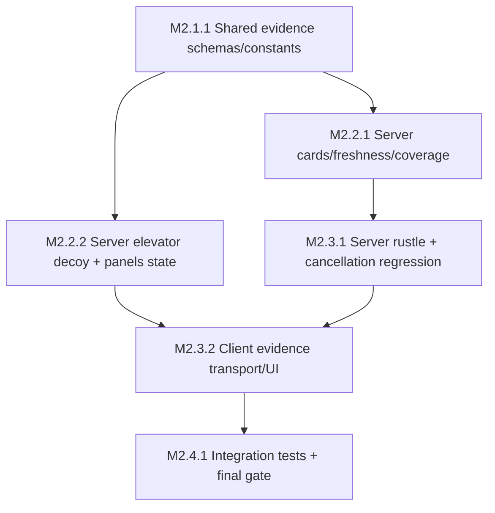

# M2 Plan — Evidence Layer

Source spec: `.dev/specs/M2-spec.md` (R-1…R-10, V-1…V-10). M1 is complete and remains the regression baseline. Tasks are ordered by ownership and dependency; parallel stages are file-disjoint where practical.

## Planner Decisions

- Freshness uses server `trashedAtTime`; `age >= FRESHNESS_WINDOW_MS` is settled.
- Coverage is an integer percentage broadcast from server state at the existing patch cadence, with a server-side 1 Hz sampling/update path.
- Elevator panels expose the existing shaft/car state and remain readable on every floor.
- Rustle uses a small bundled or procedural native WebAudio source; clients apply same-floor tile range, gain falloff, and stereo pan.
- Door cards are server evidence projections visible outside rooms and cannot be removed in M2.

## Task Graph

## Tasks

### M2.1.1 — Shared evidence contracts and tuning constants

- Stage: S1
- Depends on: []
- Parallel group: no
- Spec refs: R-2, R-3, R-4, R-6, R-9, V-2, V-3, V-4, V-6, V-9
- Files owned: `packages/shared/src/constants.ts`, `packages/shared/src/state.ts`, `packages/shared/src/messages.ts`, `packages/shared/src/index.ts`, `packages/shared/test/**`
- Description: Add and export `FRESHNESS_WINDOW_MS` and `RUSTLE_RANGE_TILES` from the shared package, extend schemas/messages for door cards, freshness timestamps/tiers, coverage percentage, elevator panel state, and sabotage events. Preserve M1 wire compatibility and strict type-only imports.
- Verify: `pnpm --filter @grandhotel/shared typecheck && pnpm --filter @grandhotel/shared build && pnpm --filter @grandhotel/shared test -- -t "tuning constants m2"` exits 0; grep confirms the two tuning values have one source in shared.

### M2.2.1 — Server evidence state: cards, freshness, coverage

- Stage: S2
- Depends on: [M2.1.1]
- Parallel group: PG-A
- Spec refs: R-1, R-2, R-3, R-7, R-8, R-10, V-1, V-2, V-3, V-7, V-8, V-10
- Files owned: `apps/server/src/**`, `apps/server/test/**`
- Description: Mark cards present on clean-to-prepped, update text on sabotage, and keep them permanent. Record server sabotage time and expose fresh/settled projection at the shared boundary. Compute/broadcast live integer coverage at 1 Hz. Extend authority guards and ensure every M1 cancellation path leaves evidence unchanged and never emits a future rustle placeholder.
- Verify: `pnpm --filter @grandhotel/server test -- -t "door card state|trash freshness transition|coverage broadcast|channel cancel no rustle|server authority evidence"` and `pnpm --filter @grandhotel/server typecheck` exit 0.

### M2.2.2 — Server elevator evidence and independent decoy calls

- Stage: S2
- Depends on: [M2.1.1]
- Parallel group: PG-A
- Spec refs: R-4, R-5, R-8, R-10, V-4, V-5, V-8, V-10
- Files owned: `apps/server/src/elevator.ts`, `apps/server/src/rooms/HotelRoom.ts`, `apps/server/test/elevator-position.spec.ts`, `apps/server/test/decoy-call.spec.ts`
- Description: Extend elevator projections with both shafts' current floor/position and patch them during call, arrival, boarding, and ride. Keep call fire-and-forget and ride separate so abandoning a call does not cancel the car; preserve M1 capacity, queue, destination, and teleport rules. Reject client attempts to write panel state.
- Verify: `pnpm --filter @grandhotel/server test -- -t "elevator position broadcast|elevator call without ride|elevator state continuous"` and `pnpm --filter @grandhotel/server typecheck` exit 0.

### M2.3.1 — Server sabotage event and rustle range contract

- Stage: S3
- Depends on: [M2.2.1]
- Parallel group: no
- Spec refs: R-6, R-7, R-8, R-9, R-10, V-6, V-7, V-8, V-9
- Files owned: `apps/server/src/channels.ts`, `apps/server/src/rooms/HotelRoom.ts`, `apps/server/test/rustle.spec.ts`, `apps/server/test/channel-cancel.spec.ts`
- Description: Emit one sabotage event only when saboteur un-prep completes. Include room, source position, and server timestamp. Add pure same-floor range/pan inputs for clients or shared consumers, using imported range constants. Ensure explicit cancel, walk-out, floor change, and elevator ride clear channels with no room mutation, event, firing, or win side effect.
- Verify: `pnpm --filter @grandhotel/server test -- -t "rustle event emission|rustle not on cancel|channel cancel comprehensive"` and `pnpm --filter @grandhotel/server typecheck` exit 0.

### M2.3.2 — Client evidence projection, panels, cards, HUD, and WebAudio

- Stage: S3
- Depends on: [M2.2.2, M2.3.1]
- Parallel group: no
- Spec refs: R-1, R-2, R-3, R-4, R-5, R-6, R-7, R-8, R-9, R-10, V-1, V-2, V-3, V-4, V-5, V-6, V-7, V-8, V-9, V-10
- Files owned: `apps/client/src/**`, `apps/client/test/**`
- Description: Extend the transport view without importing Colyseus into game/UI. Render permanent hallway door cards, fresh/settled interior trash visuals and timer, live coverage HUD, and both elevator panels. Implement separate call/ride UI. On sabotage events, apply same-floor shared tile distance, gain falloff, and stereo pan before playing a short native WebAudio rustle. Ignore events outside range or on another floor. Keep cancellation and result freeze behavior intact.
- Verify: `pnpm --filter @grandhotel/client typecheck && pnpm --filter @grandhotel/client test` exit 0; `grep -R "from ['\"]colyseus" apps/client/src/game apps/client/src/ui` returns empty; focused tests cover cards, freshness, HUD, panels, decoy calls, rustle range, and cancellation.

### M2.4.1 — M2 integration suites and evidence regression gate

- Stage: S4
- Depends on: [M2.3.1, M2.3.2]
- Parallel group: no
- Spec refs: R-1, R-2, R-3, R-4, R-5, R-6, R-7, R-8, R-9, R-10, V-1, V-2, V-3, V-4, V-5, V-6, V-7, V-8, V-9, V-10
- Files owned: `tooling/src/integration/**`, `tooling/src/harness/**`, `tooling/package.json`, `scripts/verify-m2.sh`, `package.json`
- Description: Add real-client integration checks for hallway card discovery, freshness transition, live HUD coverage, both elevator panels, abandoned decoy calls, and sabotage rustle event/cancel semantics. Add a final M2 gate chaining install, typecheck, build, shared/server/client tests, integration tests, literal sweep, Docker single-origin probe, and local smoke. Keep M1 gate green and mark live `PUBLIC_URL` evidence as operator-pending/non-blocking.
- Verify: `pnpm --filter @grandhotel/tooling test:integration -- -t "m2"` and `bash scripts/verify-m2.sh` exit 0; `pnpm verify:m2` forwards to the same gate; `bash scripts/verify-m1.sh` remains green.

## Coverage Matrix

| Requirement | Tasks                                  | Verification |
| ----------- | -------------------------------------- | ------------ |
| R-1         | M2.2.1, M2.3.2, M2.4.1                 | V-1          |
| R-2         | M2.1.1, M2.2.1, M2.3.2                 | V-2          |
| R-3         | M2.1.1, M2.2.1, M2.3.2, M2.4.1         | V-3          |
| R-4         | M2.1.1, M2.2.2, M2.3.2, M2.4.1         | V-4          |
| R-5         | M2.2.2, M2.3.2, M2.4.1                 | V-5          |
| R-6         | M2.1.1, M2.3.1, M2.3.2, M2.4.1         | V-6          |
| R-7         | M2.2.1, M2.3.1, M2.3.2, M2.4.1         | V-7          |
| R-8         | M2.2.1, M2.2.2, M2.3.1, M2.3.2, M2.4.1 | V-8          |
| R-9         | M2.1.1, M2.3.1, M2.3.2, M2.4.1         | V-9          |
| R-10        | M2.2.1, M2.2.2, M2.3.1, M2.3.2, M2.4.1 | V-10         |
