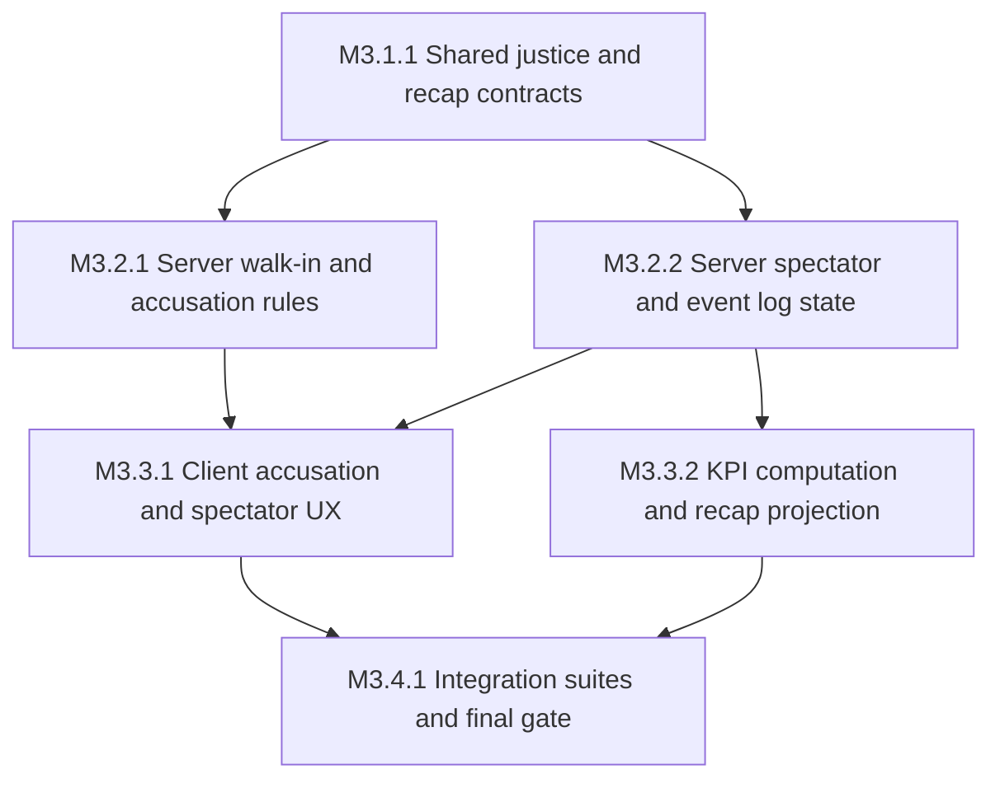

# M3 Plan — Justice + Recap

Source spec: `.dev/specs/M3-spec.md` (R-1…R-10, V-1…V-10). M2 is complete and remains the regression baseline.

## Task graph

## Tasks

### M3.1.1 — Add shared justice and recap contracts

- Stage: S1
- Depends on: []
- Parallel group: no
- Spec refs: R-2, R-3, R-5, R-6, R-7, R-9, V-2, V-4, V-5, V-6, V-7
- Files owned: `packages/shared/src/constants.ts`, `packages/shared/src/state.ts`, `packages/shared/src/messages.ts`, `packages/shared/src/index.ts`, `packages/shared/test/**`
- Description: Add the shared accusation range constant, accusation message validation, fired/spectator projection fields, and typed chronological event/recap contracts. Preserve existing wire compatibility and strict type-only import rules.
- Verify: `pnpm --filter @grandhotel/shared typecheck && pnpm --filter @grandhotel/shared build && pnpm --filter @grandhotel/shared test -- -t "tuning constants m3"` exits 0.

### M3.2.1 — Implement authoritative walk-in and accusation justice

- Stage: S2
- Depends on: [M3.1.1]
- Parallel group: PG-A
- Spec refs: R-1, R-2, R-3, R-4, R-7, R-9, R-10, V-1, V-2, V-3, V-6, V-7, V-8
- Files owned: `apps/server/src/channels.ts`, `apps/server/src/rooms/HotelRoom.ts`, `apps/server/test/walk-in.spec.ts`, `apps/server/test/accusation.spec.ts`
- Description: Add server-side entry detection for active un-prep channels, immediate saboteur firing and catch resolution, and validated accusation handling. Enforce staff-only role, active same-floor range, target eligibility, first-completed-un-prep grace period, correct/wrong firing, and all existing cancellation semantics.
- Verify: `pnpm --filter @grandhotel/server test -- -t "walk-in fire|accusation constraints|accusation grace period|channel cancel" && pnpm --filter @grandhotel/server typecheck` exits 0.

### M3.2.2 — Add spectator state, recap events, and JSONL KPI data

- Stage: S2
- Depends on: [M3.1.1]
- Parallel group: PG-A
- Spec refs: R-5, R-6, R-7, R-8, R-10, V-4, V-5, V-6, V-8
- Files owned: `apps/server/src/rooms/HotelRoom.ts`, `apps/server/src/**`, `apps/server/test/spectator.spec.ts`, `apps/server/test/recap.spec.ts`, `tooling/src/**`
- Description: Transition fired players to read-only spectator projections, reject all spectator actions, collect ordered room/elevator/crime/catch/accusation events with required validity flags, persist per-round JSONL, and expose KPI computation for win rate, correct accusations, catches/hour, discovery timing, and decoy calls.
- Verify: `pnpm --filter @grandhotel/server test -- -t "spectator mode transition|event timeline structure|event log emission" && pnpm --filter @grandhotel/tooling test -- -t "kpi"` exits 0.

### M3.3.1 — Wire client accusation, spectator, and recap views

- Stage: S3
- Depends on: [M3.2.1, M3.2.2]
- Parallel group: no
- Spec refs: R-2, R-3, R-5, R-6, R-9, R-10, V-2, V-4, V-5, V-7, V-8, V-9
- Files owned: `apps/client/src/net/**`, `apps/client/src/game/**`, `apps/client/src/ui/**`, `apps/client/src/main.ts`, `apps/client/src/style.css`, `apps/client/test/**`
- Description: Extend the transport projection without importing Colyseus into game/UI. Implement hold-E accusation confirmation and cancellation, disable round actions for fired players, render a full-building spectator overview, and render the chronological recap in results while preserving evidence and results freeze behavior.
- Verify: `pnpm --filter @grandhotel/client typecheck && pnpm --filter @grandhotel/client test` exits 0; the client game/UI Colyseus import sweep is empty.

### M3.3.2 — Verify recap projection and KPI payload end to end

- Stage: S3
- Depends on: [M3.2.2]
- Parallel group: PG-B
- Spec refs: R-6, R-7, R-8, V-5, V-6, V-9
- Files owned: `tooling/src/integration/recap.spec.ts`, `tooling/src/integration/telemetry.spec.ts`, `tooling/src/integration/spectator.spec.ts`, `tooling/src/harness/**`
- Description: Add real-client checks that a full round produces ordered recap events, valid accusation/catch metadata, spectator visibility and action rejection, and KPI-computable telemetry including decoy calls and discovery timing.
- Verify: `pnpm --filter @grandhotel/tooling test:integration -- -t "m3 recap|m3 telemetry|spectator observability"` exits 0.

### M3.4.1 — Run justice integration and regression gates

- Stage: S4
- Depends on: [M3.3.1, M3.3.2]
- Parallel group: no
- Spec refs: R-1 through R-10, V-1 through V-10
- Files owned: `tooling/src/integration/**`, `tooling/package.json`, `scripts/verify-m3.sh`, `package.json`
- Description: Add the M3 justice/recap integration suites and a final gate chaining install, all workspace typechecks/builds/tests, focused justice tests, M3 integration, literal/authority sweeps, Docker single-origin probe, local smoke, and the existing M2 gate. Keep live deployment evidence operator-pending.
- Verify: `pnpm --filter @grandhotel/tooling test:integration -- -t "m3"`, `bash scripts/verify-m3.sh`, and `bash scripts/verify-m2.sh` each exit 0; `pnpm verify:m3` forwards to the same gate.

## Coverage Matrix

| Requirement | Tasks                                          | Verification   |
| ----------- | ---------------------------------------------- | -------------- |
| R-1         | M3.2.1, M3.4.1                                 | V-1            |
| R-2         | M3.1.1, M3.2.1, M3.3.1, M3.4.1                 | V-2            |
| R-3         | M3.1.1, M3.2.1, M3.3.1, M3.4.1                 | V-2            |
| R-4         | M3.2.1, M3.4.1                                 | V-3            |
| R-5         | M3.1.1, M3.2.2, M3.3.1, M3.4.1                 | V-4            |
| R-6         | M3.1.1, M3.2.2, M3.3.1, M3.3.2, M3.4.1         | V-5            |
| R-7         | M3.1.1, M3.2.1, M3.2.2, M3.3.1, M3.3.2, M3.4.1 | V-6            |
| R-8         | M3.2.2, M3.3.2, M3.4.1                         | V-6            |
| R-9         | M3.1.1, M3.2.1, M3.3.1, M3.4.1                 | V-7            |
| R-10        | M3.2.1, M3.2.2, M3.3.1, M3.4.1                 | V-8, V-9, V-10 |
