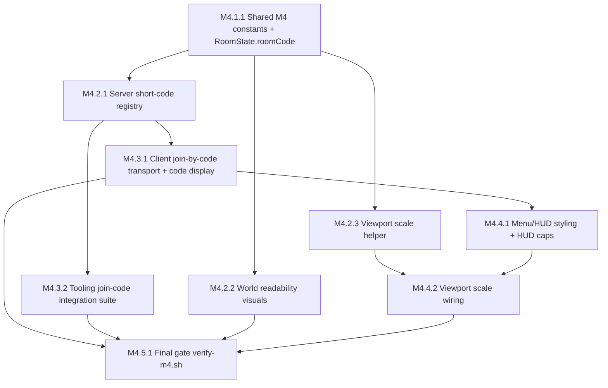

# M4 Plan — Visual pass + join code fix

Source spec: `.dev/specs/M4-spec.md` (R-1…R-7, V-1…V-11). M0–M3 remain the regression baseline.

Key sequencing decisions (see also final notes):

- `screens.ts` is touched by M4.3.1 (code chip projection) and M4.4.1 (menu/HUD styling) — these are **serialized** via `depends_on`, never parallel. `style.css` is touched by M4.4.1 and M4.4.2 — also serialized. `main.ts` is touched only by M4.4.2 (viewport wiring), kept out of M4.3.1 on purpose (`createRoom()` keeps its `Promise<string>` contract, so no main.ts change is needed for the code path).
- S2 runs three disjoint parallel builders: server (`apps/server/**`), hall scene (`apps/client/src/game/**`), pure viewport helper (`apps/client/src/ui/viewportScale.ts` + one new test file). No shared files.
- The V-1 end-to-end suite lives in `tooling/` (M4.3.2), disjoint from all client-app work, so it runs in parallel with M4.3.1.

## Task graph

## Tasks

### M4.1.1 — Add shared M4 layout constants and RoomState.roomCode field

- Stage: S1
- Depends on: []
- Parallel group: no
- Spec refs: R-1, R-5, R-6, R-7, V-6, V-7, V-9
- Files owned: `packages/shared/src/constants.ts`, `packages/shared/src/state.ts`, `packages/shared/test/constants.spec.ts`
- Description: In `packages/shared/src/constants.ts` add the M4 free variables, each with the established doc-comment style: `STAGE_WIDTH_PX = 960`, `STAGE_HEIGHT_PX = 540` (design size for the Phaser canvas and DOM overlay), `VIEWPORT_MIN_WIDTH_PX = 700`, `FLOOR_TINTS` as a readonly tuple of `FLOOR_COUNT + 1` distinct hex color strings (index 0 = lobby tint, index n = floor n), `AVATAR_BODY_SIZE_PX = 28`, `AVATAR_LABEL_FONT_SIZE_PX = 14`, and `HUD_NAME_MAX_CHARS = 14` (roster chip truncation length). No new R-1 constants are needed — `ROOM_CODE_LENGTH`/`ROOM_CODE_ALPHABET` already exist and remain the only source. In `packages/shared/src/state.ts` add a decorated field to `RoomState`: `@type("string") roomCode = "";` (server-assigned short code, default empty so old decodes stay compatible; it is presentation/session info, not rule-bearing). Export everything through the existing index. Add tests to `constants.spec.ts` under a describe named `m4 tuning constants (V-6/V-7)`: FLOOR_TINTS length is `FLOOR_COUNT + 1` and all values distinct; every new constant exists with the documented values; `RoomState` default `roomCode === ""`. Do not touch any consumer files — later tasks import these.
- Verify: `pnpm --filter @grandhotel/shared typecheck && pnpm --filter @grandhotel/shared build && pnpm --filter @grandhotel/shared test -- -t "m4 tuning constants"` exits 0.

### M4.2.1 — Server short-code registry, assignment, and disposal release

- Stage: S2
- Depends on: [M4.1.1]
- Parallel group: PG-A (with M4.2.2, M4.2.3 — disjoint files)
- Spec refs: R-1, R-7, V-2, V-9
- Files owned: `apps/server/src/rooms/roomCodes.ts`, `apps/server/src/rooms/HotelRoom.ts`, `apps/server/test/room-code.spec.ts`
- Description: Create `apps/server/src/rooms/roomCodes.ts` with (a) a pure `generateRoomCode(rand: () => number): string` drawing exactly `ROOM_CODE_LENGTH` characters from `ROOM_CODE_ALPHABET` (imports from `@grandhotel/shared` — no literals, per V-9), and (b) `class RoomCodeRegistry` with `acquire(rand?: () => number): string` (generate + retry against live-code set until unique, bounded attempts e.g. 64 then throw), `release(code: string): void` (idempotent), `has(code): boolean`, `size`, and `clearAll()` for tests. Instantiate one module-scope registry (single process = single source of uniqueness) exported for tests. In `HotelRoom.onCreate`, acquire a code from the registry, assign it to `this.state.roomCode`, and publish it for matchmaking with `this.setMetadata({ roomCode: code })` (Colyseus 0.15 idiom — listings carry `metadata.roomCode`, which is how clients resolve without any custom HTTP endpoint). In `onDispose`, `release(this.state.roomCode)` before/after the existing `clockAdapter.clearAll()`. Directly-constructed test rooms keep the existing `listing` stub — setMetadata must tolerate that path. Add `apps/server/test/room-code.spec.ts` with describe `room code lifecycle (V-2)` covering: generated codes are length-exact and alphabet-valid; two concurrently created rooms never share a code (create N rooms via direct construction, assert N distinct codes); after `onDispose()` the code is released (registry size drops, a subsequent acquire can legally return codes not colliding with live rooms); uniqueness holds across sequential create/dispose cycles; `generateRoomCode` is deterministic for a seeded rand.
- Verify: `pnpm --filter @grandhotel/server typecheck && pnpm --filter @grandhotel/server test -- -t "room code"` exits 0.

### M4.2.2 — Hall scene readability: floor tints, clearer markers, larger labeled avatars

- Stage: S2
- Depends on: [M4.1.1]
- Parallel group: PG-A (with M4.2.1, M4.2.3 — disjoint files)
- Spec refs: R-6, R-7, V-7
- Files owned: `apps/client/src/game/avatarIdentity.ts`, `apps/client/src/game/HallScene.ts`, `apps/client/test/world-readability.test.ts`
- Description: Client presentation only — no physics, no collision bodies, no interactive bodies beyond the existing elevator buttons; positions remain client-reported presence. Create pure module `apps/client/src/game/avatarIdentity.ts`: `deriveAvatarVisuals(name: string, colorIndex: number): { colorHex: string; initial: string }` where colorHex is `AVATAR_COLORS[colorIndex % AVATAR_COLORS.length]` (import from shared, keep the existing `#888` fallback out — colorIndex is always in range) and initial is the first character of the trimmed name uppercased (`"? "` fallback when empty). Also export `FLOOR_TINT_HEXES: readonly number[]` derived by parsing `FLOOR_TINTS` from shared with the existing `parseHexColor` helper (move `parseHexColor` into this module or keep local — do not duplicate it elsewhere). In `HallScene.renderBuilding`, use `FLOOR_TINT_HEXES[floor]` for each hallway strip instead of the uniform `0x888888`; keep the existing state colors exactly (prepped green `0x2a9d2a`, trashed red `0xb00020`, trash fresh `0xff2020`/settled `0x666666`, door card `0xd9a03c`, elevator button green `0x448844`) — export these as a `MARKER_COLORS` const in the same module so the test can assert preservation. Clarify elevator/door markers: add "A"/"B" `Text` labels to the shafts, thicken door lines (`setLineWidth(3)`) and brighten the door line color — these are presentation changes only and must not alter hit-areas or state logic. Enlarge avatars: local and remote avatar rectangles sized `AVATAR_BODY_SIZE_PX` (square) filled from `deriveAvatarVisuals(...).colorHex`, each with a non-interactive `Text` child showing the initial at `AVATAR_LABEL_FONT_SIZE_PX`; keep `addRemote`/`removeRemote`/`setRemoteX`/`setRemoteFloor` semantics identical, just bigger visuals + label. Add `apps/client/test/world-readability.test.ts` with describe `world readability (V-7)`: FLOOR_TINT_HEXES has `FLOOR_COUNT + 1` distinct values matching shared FLOOR_TINTS; MARKER_COLORS preserves the legacy state hexes listed above; `deriveAvatarVisuals` returns the right AVATAR_COLORS entry + uppercase initial per player and distinguishes two players with different colorIndex/name. Test only pure exports (importing Phaser-dependent HallScene is NOT required by this test).
- Verify: `pnpm --filter @grandhotel/client test -- -t "world readability" && pnpm --filter @grandhotel/client typecheck` exits 0.

### M4.2.3 — Pure viewport scale computation helper

- Stage: S2
- Depends on: [M4.1.1]
- Parallel group: PG-A (with M4.2.1, M4.2.2 — disjoint files)
- Spec refs: R-5, R-7, V-6
- Files owned: `apps/client/src/ui/viewportScale.ts`, `apps/client/test/viewport-scale.test.ts`
- Description: Pure computation only — no Phaser, no DOM, no CSS, no main.ts wiring (that is M4.4.2). Create `apps/client/src/ui/viewportScale.ts` exporting `VIEW_DESIGN_WIDTH_PX = STAGE_WIDTH_PX` and `VIEW_DESIGN_HEIGHT_PX = STAGE_HEIGHT_PX` re-exported for consumers, and `computeViewportScale(viewportWidthPx: number): { scale: number; belowFloor: boolean; fitWidthPx: number }` using `STAGE_WIDTH_PX`/`VIEWPORT_MIN_WIDTH_PX` from `@grandhotel/shared` (no literals): at `viewportWidthPx >= STAGE_WIDTH_PX` return scale 1; between the 700px floor and 960px return the proportional `viewportWidthPx / STAGE_WIDTH_PX`; below `VIEWPORT_MIN_WIDTH_PX` set `belowFloor = true` and clamp scale to `VIEWPORT_MIN_WIDTH_PX / STAGE_WIDTH_PX` (the visible below-floor message is wired in M4.4.2). `fitWidthPx = Math.round(scale * STAGE_WIDTH_PX)`. Add `apps/client/test/viewport-scale.test.ts` with describe `viewport scale (V-6)`: full-size (scale 1, fitWidth 960) at 960 and above; proportional values (e.g. 840 → 840/960) in the middle band; `belowFloor` true and clamped scale at <700 (e.g. 640); boundary cases exactly 700 and 699; and one assertion that the module imports the constants from `@grandhotel/shared` rather than redefining them (grep the source file text for `from "@grandhotel/shared"`). The "movement math untouched" half of V-6 is verified by the shared suite staying green — include `pnpm --filter @grandhotel/shared test` in the verify command.
- Verify: `pnpm --filter @grandhotel/client test -- -t "viewport scale" && pnpm --filter @grandhotel/shared test` exits 0.

### M4.3.1 — Client transport: resolve join-by-code via listings, project the short code

- Stage: S3
- Depends on: [M4.2.1]
- Parallel group: PG-A (with M4.3.2 — disjoint files)
- Spec refs: R-2, R-7, V-2, V-3
- Files owned: `apps/client/src/net/GameClient.ts`, `apps/client/src/net/ColyseusGameClient.ts`, `apps/client/src/ui/reducer.ts`, `apps/client/src/ui/screens.ts`, `apps/client/test/net/ColyseusGameClient.test.ts`
- Description: Transport boundary respected — Colyseus imports stay in `apps/client/src/net/` only; `screens.ts`/`reducer.ts` consume the `RoomStateView` projection. In `GameClient.ts` add `roomCode: string | null` to `RoomStateView` (documented as the server-assigned joinable short code, `null` until synced). In `ColyseusGameClient.toView` map `roomCode` from the raw state (empty string → null). In `createRoom()`: keep the `Promise<string>` signature but return the short code — after `joinOrCreate`, poll `this.lastView?.roomCode` (e.g. up to ~2s at 50ms) until non-null and return it; on timeout fall back to the raw room id string so callers never break. In `joinByCode(code)`: normalize (trim/uppercase, same as today); call `await this.client.getAvailableRooms("hotel")` and find the listing whose `metadata?.roomCode === normalized`; if no listing matches, emit `{ type: "rejected", reason: "not-found" }` and throw `Error("not-found")` BEFORE any join attempt (classified rejection, never an unhandled MatchMakeError); otherwise `joinById(resolvedListingId)`. Keep `classifyJoinError`'s existing not-found classification as the backstop. In `screens.ts` `renderHudBar`, prefer the projection: `codeChip.textContent = `Code: ${view?.roomCode ?? state.code}`` — the HUD/menu must show the server-assigned code, never the raw `roomId`. In `reducer.ts` no behavioral change is required beyond keeping `joined` flowing the returned code (adjust only if the type system demands it). Extend `apps/client/test/net/ColyseusGameClient.test.ts` (mock `colyseus.js` with the file's existing pattern): a suite containing `code display (V-3)` proving `toView`/`createRoom` surface the projected short code and never the raw roomId to callers; and a suite containing `room code (V-2 client half)` proving `joinByCode` resolves a well-formed displayed code through listings (assert joinById got the resolved room id, not the code) and rejects a well-formed but nonexistent code with `{ type: "rejected", reason: "not-found" }`. `main.ts` must NOT be edited in this task.
- Verify: `pnpm --filter @grandhotel/client test -- -t "code display|room code" && pnpm --filter @grandhotel/client typecheck && bash -c '! grep -R "from .colyseus" apps/client/src/game apps/client/src/ui'` exits 0 (the grep is empty).

### M4.3.2 — Tooling end-to-end join-code integration suite

- Stage: S3
- Depends on: [M4.2.1]
- Parallel group: PG-A (with M4.3.1 — disjoint files)
- Spec refs: R-1, R-2, V-1
- Files owned: `tooling/src/integration/joinCode.spec.ts`, `tooling/src/harness/clients.ts`
- Description: Additive harness helpers in `tooling/src/harness/clients.ts` (existing exports and their behavior are untouched, so all M0–M3 suites keep passing): `getRoomCode(c: HarnessClient): string | null` reading the replicated `c.room.state.roomCode`, and `joinByPublishedCode(c: HarnessClient, code: string): Promise<void>` that resolves the code via `c.client.getAvailableRooms("hotel")` → `metadata.roomCode` match → `joinById(resolvedId)` (throws a clear error when no listing matches, so the suite can assert the negative case). New `tooling/src/integration/joinCode.spec.ts` with describe `integration join code (V-1)`: client 1 `createRoom`s, reads the published short code via `getRoomCode` (and cross-checks the room's `metadata.roomCode` from listings), asserts it is exactly `ROOM_CODE_LENGTH` characters drawn from `ROOM_CODE_ALPHABET`; client 2 joins by exactly that code string via `joinByPublishedCode`; `waitForRoster` proves both rosters contain both names with 2 players each; assert both clients landed in the same underlying room (`A.room.roomId === B.room.roomId`); negative case: `joinByPublishedCode` with a well-formed but unassigned code (e.g. a valid-alphabet 4-char string verified absent from listings) rejects. Follow the existing suite structure (spawnServer/makeClient/afterEach cleanup, ~15s timeouts).
- Verify: `pnpm --filter @grandhotel/tooling test:integration -- -t "join code"` exits 0.

### M4.4.1 — Menu/name card styling + HUD bar caps

- Stage: S4
- Depends on: [M4.3.1]
- Parallel group: no (serialized behind M4.3.1: both edit `screens.ts`; this task then owns `style.css` exclusively until M4.4.2)
- Spec refs: R-3, R-4, R-7, V-4, V-5, V-11
- Files owned: `apps/client/src/ui/screens.ts`, `apps/client/src/ui/hudText.ts`, `apps/client/src/style.css`, `apps/client/test/screens-styling.test.ts`
- Description: Presentation only — no rule-bearing information may be lost. Create pure `apps/client/src/ui/hudText.ts`: `truncateName(name: string, maxChars: number = HUD_NAME_MAX_CHARS): string` (imports `HUD_NAME_MAX_CHARS` from shared; appends "…" when truncated) and `chipFits(...)` not needed — keep the module to truncation + a `phaseLabel`-style helper only if genuinely reused. In `screens.ts`: wrap the name and menu screens in a `.screen-card` container with a `.screen-title` heading carrying the game title ("Turnover") on both screens (pure DOM, no art assets); apply `truncateName` to roster chip names in `renderHudBar` and to the results reveal line where names render; the roster still renders up to `MAX_PLAYERS` entries (sizing respected — no cap-bypassing logic); all rule-bearing chips (phase, floor, code, elevators, fired badges) keep rendering. In `style.css`: card styles for `.screen-card`/`.screen-title` (consistent padding/margins, subtle shadow, centered max-width); `:focus-visible` outline rules for `#overlay button, #overlay input` (visible keyboard focus states); HUD fit rules — `.hud-chip { min-width: 0; max-width: 22ch; overflow: hidden; text-overflow: ellipsis; }` and `.roster { flex-wrap: wrap; }` with roster `li` name spans ellipsized, so the bar wraps/shrinks instead of clipping at left/right edges. Tests in `apps/client/test/screens-styling.test.ts` (jsdom render pattern from `accusation-ui.test.ts`): describe `menu styling (V-4)` — rendering the name and menu screens yields the card/title structure (`.screen-card`, `.screen-title` with the game title text) and `style.css` (read as file text) contains a `:focus-visible` rule; describe `hud caps (V-5)` — `truncateName` ellipsizes a >max name and leaves a short name intact; rendering the HUD bar with `MAX_PLAYERS` roster entries (long names included) produces exactly MAX_PLAYERS chips each ellipsized, with phase/floor/code/elevator chips and fired badges still present.
- Verify: `pnpm --filter @grandhotel/client test -- -t "menu styling|hud caps" && pnpm --filter @grandhotel/client typecheck` exits 0.

### M4.4.2 — Wire proportional viewport scaling + below-floor message

- Stage: S4
- Depends on: [M4.2.3, M4.4.1]
- Parallel group: no (chained: takes `style.css` from M4.4.1 and `main.ts` exclusively)
- Spec refs: R-5, R-7, V-6, V-11
- Files owned: `apps/client/src/ui/applyViewportScale.ts`, `apps/client/src/main.ts`, `apps/client/src/style.css`, `apps/client/index.html`, `apps/client/test/viewport-scale.test.ts`
- Description: Replace the fixed 960px behavior with proportional scaling driven by `computeViewportScale` from M4.2.3. Create `apps/client/src/ui/applyViewportScale.ts`: pure-ish `applyViewportScale(root: HTMLElement, viewportWidthPx: number): { scale: number; belowFloor: boolean }` that sets `root.style.setProperty("--gh-scale", String(scale))` and toggles a `#viewport-floor-message` element's `hidden` flag when `belowFloor` (message element must exist; create it under `root` if missing, text like "Window too small — widen to at least 700px"). Scaling strategy (planner choice per spec): CSS transform — `#app` gets `transform: scale(var(--gh-scale))` with `transform-origin: top center`, and a wrapping spacer/parent sized to `fitWidthPx` so layout doesn't leave a dead zone; the `#overlay` is inside `#app`'s coordinate space so it scales identically (both stage and DOM overlay). In `main.ts` Phaser config, replace the `width: 960, height: 540` literals with `STAGE_WIDTH_PX`/`STAGE_HEIGHT_PX` from shared (R-7 literal sweep), and attach a `resize` listener at boot that calls `applyViewportScale(document.getElementById("app")…, window.innerWidth)` (initial call included). Do NOT touch `apps/client/src/movement/**` or `HallScene` movement/input logic — pointer accuracy over the scaled canvas is asserted manually in V-11 (SKIP-MANUAL), so the implementation must keep input listeners unchanged and rely on standard canvas coordinate mapping. Add skeleton `
…
` to `apps/client/index.html`. Extend `apps/client/test/viewport-scale.test.ts` with a describe containing `viewport scale (V-6 wiring)`: jsdom test proving `applyViewportScale` sets the `--gh-scale` custom property to the computed scale for representative widths (960/840/640) and toggles the message element only below 700px. Add a file-level regression note + assertion that movement math stays untouched: the verify step runs the shared suite (movement constants/step logic live green) and the existing client movement tests.
- Verify: `pnpm --filter @grandhotel/client test -- -t "viewport scale" && pnpm --filter @grandhotel/client test -- -t "clamp" && pnpm --filter @grandhotel/shared test && pnpm --filter @grandhotel/client build` exits 0.

### M4.5.1 — Final M4 gate: verify-m4.sh + root script

- Stage: S5
- Depends on: [M4.2.1, M4.2.2, M4.3.1, M4.3.2, M4.4.1, M4.4.2]
- Parallel group: no
- Spec refs: R-1, R-2, R-3, R-4, R-5, R-6, R-7, V-1, V-2, V-3, V-4, V-5, V-6, V-7, V-8, V-9, V-10, V-11
- Files owned: `scripts/verify-m4.sh`, `package.json`, `tooling/package.json`
- Description: Create `scripts/verify-m4.sh` mirroring `scripts/verify-m1.sh` structure (helpers, cleanup trap, PASS/FAIL summary, exit code). Steps: (1) `pnpm install --frozen-lockfile`; (2) `pnpm -r typecheck && pnpm -r build` + the colyseus-boundary grep (`apps/client/src/game`, `apps/client/src/ui` must contain no `from "colyseus` imports); (3) `pnpm --filter @grandhotel/shared test -- -t "tuning constants m4|topology"`; (4) `pnpm --filter @grandhotel/server test` (full suite = V-2 room code); (5) `pnpm --filter @grandhotel/client test` (full suite = V-3/V-4/V-5/V-6/V-7); (6) `pnpm --filter @grandhotel/tooling test:integration` (full = V-1 join code + M0–M3 regression); (7) **non-vacuity guard** for the V-tag selectors: grep the test sources for each tag string (`join code`, `room code`, `code display`, `menu styling`, `hud caps`, `viewport scale`, `world readability`) and fail the gate if any selector matches 0 test files (the M1 lesson — a `-t` filter silently passing with 0 matched tests); (8) literal sweep (V-9): grep `apps/server/src` + `apps/client/src` for duplicated tuning literals — the alphabet string `ABCDEFGHJKMNPQRSTUVWXYZ23456789` and any `FLOOR_TINTS|STAGE_WIDTH_PX|STAGE_HEIGHT_PX|VIEWPORT_MIN_WIDTH_PX|AVATAR_BODY_SIZE_PX|HUD_NAME_MAX_CHARS|ROOM_CODE_LENGTH|ROOM_CODE_ALPHABET` assignment outside `packages/shared` must fail the gate (import-list usage lines with a shared import are excused, mirroring the m1 audit pattern); (9) Docker single-origin probe (healthz + GET / `id="overlay"`), reused from verify-m1.sh including its local-fallback path; (10) smoke: boot the built flattened server entry on a scratch port with `STATIC_DIR=apps/client/dist` and run the two-client `tsx src/smoke.ts --url …` handshake. Summary prints V-1…V-10 derived from the steps and `V-11 (SKIP-MANUAL)` — the operator browser walkthrough (two-browser join by displayed code, ~1024px/720px HUD fit, click-mapping on scaled canvas) stays non-blocking per spec; note it in the summary like the m1 gate's manual supplements. Add `"verify:m4": "bash scripts/verify-m4.sh"` to root `package.json` scripts. Do not weaken any prior gate; `pnpm -r test`/`test:integration` cover the M0–M3 suites unchanged.
- Verify: `grep -q '"verify:m4"' package.json && bash scripts/verify-m4.sh` exits 0 (the script itself gates every V-1…V-10 step and prints V-11 as SKIP-MANUAL).

## Coverage Matrix

| Requirement | Tasks | Verification |
| ----------- | ----- | ------------ |
| R-1 | M4.1.1, M4.2.1, M4.3.1, M4.3.2, M4.5.1 | V-1, V-2, V-9 |
| R-2 | M4.3.1, M4.3.2, M4.5.1 | V-1, V-2, V-3 |
| R-3 | M4.4.1, M4.5.1 | V-4, V-11 (SKIP-MANUAL) |
| R-4 | M4.4.1, M4.5.1 | V-5, V-11 (SKIP-MANUAL) |
| R-5 | M4.1.1, M4.2.3, M4.4.2, M4.5.1 | V-6, V-11 (SKIP-MANUAL) |
| R-6 | M4.1.1, M4.2.2, M4.5.1 | V-7, V-11 (SKIP-MANUAL) |
| R-7 | M4.1.1, M4.2.1, M4.2.3, M4.3.1, M4.4.2, M4.5.1 | V-9, V-10 |

## Spec-gap flags

- None blocking. Two deliberate interpretations recorded here for the reviewer: (1) "display the code consistently in the menu and HUD" is implemented as: the HUD code chip (and the in-room menu surface) shows the projected `roomCode`; the pre-room menu screen has no code to show yet, so it shows join-by-code input only. (2) The existing harness path that joins by raw `roomId` (`joinById` in `tooling/src/harness/clients.ts`, used by all M0–M3 suites) is intentionally left working — internal transport by raw id is allowed per spec; only the *displayed-code* path gains resolution semantics, which keeps M0–M3 regression tests green unchanged.
